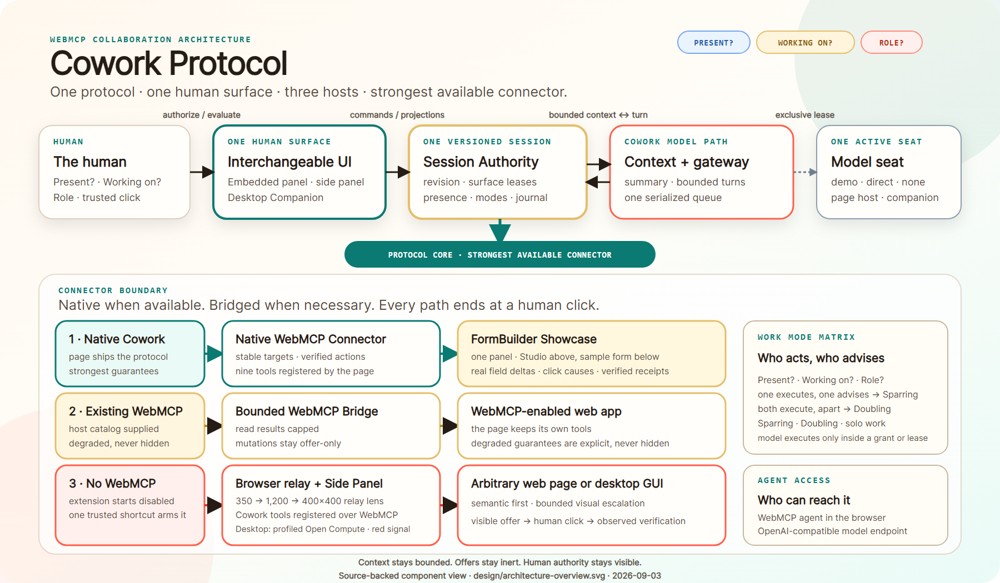

# Cowork Protocol

Cowork Protocol is a small collaboration contract for people and web agents. It gives an agent the smallest useful context, makes proposed changes visible, keeps human clicks distinct from agent calls, and supports tightly scoped solo work while the human is away.

> Native when available. Bridged when necessary.

**[Try the live showcase](https://ellmos-ai.github.io/cowork-protocol/apps/formbuilder-showcase/)** · **[Watch the demo video](https://youtu.be/9CJehV7Bugk)** · [Three in one: protocol, surface, hosts](docs/hosts.md) · [Architecture](docs/architecture.md) · [Work modes](docs/work-modes.md) · [Evidence ledger](docs/evidence.md) · [Pre-existing and new work](PREEXISTING-AND-NEW.md)

**Install it with your AI assistant:** hand [docs/install-with-your-assistant.md](docs/install-with-your-assistant.md) to Claude Code, Codex CLI or a comparable agent and say "install this for me". [`llms.txt`](llms.txt) is the machine-readable index.

## Three in one

The protocol is the submission; everything else here exists to show it holds up
wherever the human happens to be. Four ways to use it, in order of how much
each one brings with it:

1. **Protocol only** — the packages, wired into your own app's own UI. No Cowork surface at all.
2. **Protocol plus the embedded panel** — one instrument the page itself renders, no install. The live showcase runs at this level.
3. **Browser extension** — a side panel for pages that carry neither, registering the same Cowork tools over WebMCP.
4. **Desktop Companion** — an app window without an extension: freer, not tied to one browser, with a filtered Computer Use fallback, and while connected it holds the session's model seat.

[](docs/architecture.md)

The protocol and the UI are separate products. A website decides whether it
ships no page UI, an automatic operator-selected UI, or a user-activated
optional UI. Cowork's page panel, Extension Side Panel and Companion are only
reference clients; Codex, Claude and other compatible provider surfaces can use
the same collaboration infrastructure while retaining their own chat context.
Websites may deliberately embed the Cowork reference UI as their selected
consumer, giving users the same collaboration path without installing the
extension; FormBuilder demonstrates this `protocol-and-ui` mode.
The runtime independently chooses the strongest connector the current page
actually provides: native Cowork, a bounded bridge for existing WebMCP tools,
or the default-off browser relay for a page without WebMCP. The
[architecture document](docs/architecture.md) and accepted
[post-audit session architecture](docs/post-audit-session-architecture.md)
record the detailed contract and migration path.

## What changes for the person filling in the form

**Before.** An agent that wants to help with a form has two poor options. It can
read the whole page and spend its context on markup nobody looks at, or it can
act on a guess. In both cases the person cannot see what the agent is about to
do, and an agent that is able to act at all is able to act unasked. Every turn
adds to a transcript that keeps growing, so the longer the collaboration lasts,
the more it costs and the less it focuses.

**After.** The person points at one field. The agent receives a focus packet
capped at 350 code units — that field, its stable ID and the capabilities that
actually apply to it — instead of the page. If that is not enough, it can
request exactly one further bounded context level, and it has to give a reason.
The agent then proposes an exact, human-readable value, and the input stays
unchanged: the proposal cannot authorize itself. The value is applied by the
person's real click, and the app answers with a receipt naming the offer and the
click that caused it. Feedback and changes are read back latest-only, so the
agent sees the current state rather than an ever-growing history. When the
person steps away, they hand over a lease scoped to one field with a call budget
and an expiry; the agent may continue only inside it, and the lease ends when the
page changes. Silence and unchanged state produce no packet at all.

## Why WebMCP

The agent reads a structured `cowork_read_focus` tool instead of guessing from the whole interface. FormBuilder contributes a stable target ID and only the capabilities relevant to that field. User-authored text is marked untrusted, selected text over 160 JavaScript UTF-16 code units becomes a length plus digest, and normal focus text is capped at 350 code units.

## What the prototype does today

- **Bounded attention instead of page dumps.** Character-capped focus packets, a
  digest for long selections, and one reasoned, one-shot context request capped
  at 1,200 adapter characters. Silence and unchanged state emit nothing.
- **Offers that cannot authorize themselves.** An agent proposes an exact visible
  value; only a real human click applies it, and every change comes back as a
  causal, latest-only receipt with click-authenticated feedback.
- **Three questions instead of a settings panel.** Each partner answers who is
  here, on what, and in which role - executing or advising. The work mode and the
  click right follow; nothing chooses action rights separately. A model executes
  only inside a versioned, budgeted, expiring grant or lease, so "away" never
  means "unattended" and a present human is never a substitute for the record.
  See [docs/work-modes.md](docs/work-modes.md).
- **One conversation across surfaces.** Page panel, extension Side Panel and
  desktop Companion share a single versioned session; an optional same-origin
  model host attaches a preferred model while endpoint and key stay on the
  server, never in the browser.
- **Three connector paths, each labeled honestly.** Native Cowork first, then a
  bounded bridge over existing WebMCP tools, then a default-off relay for pages
  without WebMCP — every step reports its reduced guarantees instead of pretending
  they are equal.
- **A working showcase, not a mock.** The FormBuilder journey runs the real
  contracts end to end: attention lens, work modes, offers, receipts, feedback,
  authority handover, solo leases and typed or spoken conversation.

The component-level detail behind each point is in
[docs/architecture.md](docs/architecture.md) and in the [Packages](#packages)
list below; what is proven versus still open is recorded under
[Evidence and boundaries](#evidence-and-boundaries).

## Run the local showcase

Requirements: Node.js 22 or newer.

```powershell
npm start
```

Then open `http://127.0.0.1:4173/apps/formbuilder-showcase/` in a WebMCP-capable browser.

### Connect a preferred model without browser secrets

The optional host accepts an OpenAI-compatible chat-completions endpoint. Provider behavior may vary, so a real endpoint still needs its own acceptance run.

```powershell
$env:COWORK_MODEL_ENDPOINT='http://127.0.0.1:11434/v1/chat/completions'
$env:COWORK_MODEL_ID='your-model-id'
$env:COWORK_MODEL_API_KEY='optional-server-only-key'
$env:COWORK_MODEL_REASONING_EFFORT='none' # optional: none, low, medium, high, max
$env:COWORK_MODEL_MAX_TOKENS='200' # optional: 64–500; default 500
$env:COWORK_MODEL_TIMEOUT_MS='120000' # optional; maximum 120000
npm run start:model
```

Open the same local URL. The panel changes from `Local demo helper` to `Connected model bridge` only after same-origin discovery succeeds. The browser sends just `{ protocolVersion, turn }`; endpoint, model ID and API key stay in the server process. See [docs/model-host.md](docs/model-host.md).

## Verify the slice

```powershell
npm test
npm run demo:adapter
npm run eval
npm run proof
npm run check:architecture
npm run check:secrets
npm run build:companion
npm run smoke:companion
npm run smoke:companion-cockpit
npm run smoke:companion-native
npm run smoke:model-host
npm run smoke:webmcp
npm run smoke:surface
npm run smoke:accessibility
npm run smoke:contrast
```

The suite uses Node's built-in test runner and has no external runtime dependency. What each command proves, and where its boundary lies, is described under [Evidence and boundaries](#evidence-and-boundaries).

## Run the no-extension Desktop Companion

The Companion persists sessions, opens a movable Edge/Chrome app window by
default and starts the presence-colored Windows tray icon. A preferred model is
optional; without one the session UI and handoff remain available while model
input is disabled.

```powershell
$env:COWORK_ALLOWED_ORIGINS='http://127.0.0.1:4173,https://ellmos-ai.github.io'
$env:COWORK_MODEL_ENDPOINT='http://127.0.0.1:11434/v1/chat/completions' # optional
$env:COWORK_MODEL='your-model-id'                                      # optional
npm run start:companion-host
```

Set `COWORK_OPEN_WINDOW=0` or `COWORK_TRAY=0` to disable either presentation.
Set `COWORK_COMPUTER_USE=0` to remove the lazy Open Compute fallback. It defaults
to the non-executing `confirm` safety ceiling; see
[apps/desktop-companion/README.md](apps/desktop-companion/README.md) for the
explicit operator override and the bundled token-filter profile.

## Model seat

One switch decides who answers in the showcase, instead of demo behaviour spread
over several buttons. `apps/formbuilder-showcase/src/model-seat.js` resolves it
in a fixed order and labels the result honestly:

- **Demo mode on** — a disclosed scripted helper answers and proposes fixed
  values. It is labeled `Demo helper (scripted)`; nothing there comes from a
  language model.
- **Demo mode off** — an injected model transport wins first, then a direct
  browser connection to an OpenAI-compatible endpoint (a local Ollama or LM
  Studio from a locally served copy; on the HTTPS Pages deployment the endpoint
  must itself be `https://`), then a same-origin model host started with
  `npm run start:model`.
- **Nothing connected** — the seat says so and proposes nothing. The turn is
  still published for a WebMCP agent, which answers it through `cowork_read_turn`
  and `cowork_reply_turn`. There is no silent fallback to the script: outside
  demo mode `builder-model-suggester.js` raises on a missing, malformed or
  duplicate model answer rather than displaying a suggestion that only looks
  like the model worked.

While the Desktop Companion is connected it holds the session's model seat and
answers for the whole session. The switch and its endpoint fields live in the
page's **Model seat** panel (`apps/formbuilder-showcase/index.html`); the API key
is kept in the tab only, never in the page's persistent storage.

### The three Cowork surfaces

The same versioned session is reachable from three places, and the names are not
interchangeable:

| Level | Surface | What it is |
| --- | --- | --- |
| 1 | Protocol only | the packages, wired into your own app's own UI. No Cowork surface at all |
| 2 | Embedded panel | the Cowork instrument the page itself renders, no install. This showcase runs at this level |
| 3 | Browser extension | the Cowork Browser Companion, Chrome's side panel outside the page DOM, for pages that carry neither the protocol nor a panel |
| 4 | Desktop Companion | the loopback app window with a Windows tray icon, no extension; while connected it holds the session's model seat |

## Build the optional browser extension

```powershell
npm run build:companion
```

Load the generated `dist-browser-companion` directory as an unpacked extension. It is a separate optional adapter artifact and is not included in the Pages deployment. See [apps/browser-companion/README.md](apps/browser-companion/README.md).

## Build the web-only release

```powershell
npm run build:pages
npm run preview:pages
```

The allowlisted `dist/` artifact contains only the browser showcase and required runtime modules. The included GitHub Pages workflow is manual-only; neither a local build nor a later push deploys automatically. See [docs/deployment.md](docs/deployment.md).

## Native WebMCP tools

- `cowork_read_focus` returns the current character-bounded focus packet.
- `cowork_request_context` returns one reasoned, target-bound related-context level capped at 1,200 adapter characters.
- `cowork_offer_action` creates a visible offer; it never authorizes or executes the change.
- `cowork_read_presence` returns the explicit human/agent work mode in the published 0.1 vocabulary; the derived matrix state is carried alongside it.
- `cowork_execute_solo` executes only inside a valid, scoped and unexpired solo lease.
- `cowork_read_changes` returns only the latest digest-based causal change while the lens is enabled.
- `cowork_read_feedback` returns only the latest bounded, click-authenticated human evaluation.
- `cowork_read_turn` returns only the latest pending bounded human conversation turn.
- `cowork_reply_turn` returns bounded text and at most three visible offers for that exact turn; it never executes an offer.

## Packages

- `packages/core` — protocol packets, causal changes, human feedback, state decisions, authorizations and budgets.
- `packages/conversation` — provider-neutral bounded turns and replies plus a latest-only pull inbox; silence and a paused agent never call the host model transport.
- `packages/model-transport` — browser discovery plus a server-side OpenAI-compatible gateway; the browser sees neither provider configuration nor credentials.
- `packages/formbuilder-connector` — maps a stable FormBuilder field into a native Cowork focus, plus the same offer/plan contract for three canvas-editing capabilities (add/update/move a field) used by the Builder below.
- `packages/native-webmcp` — registers the nine Cowork tools with the current WebMCP API.
- `packages/integration-contract` — declares provider-neutral protocol hosts,
  replaceable surface clients and the three operator-controlled page-UI modes.
- `packages/reference-ui` — shared Cowork reference-surface identity, human/model
  icons and the single work-mode vocabulary (status labels, mode labels, the three
  status steps) consumed by FormBuilder Embed, the extension Side Panel and the
  Desktop Companion. No surface writes its own status wording.
- `packages/session-authority` — owns versioned collaboration snapshots, bounded deltas, exact-revision surface handoffs and compact optional model briefings shared across Cowork surfaces.
- `packages/companion-link` — performs a loopback-only, exact-revision
  Companion join and ordered delta acknowledgement.
- `packages/context-manager` — persists a compact summary plus a bounded recent
  turn window and creates cross-provider Handoff Capsules.
- `packages/model-gateway` — enforces the active model-seat lease, deduplicates
  turn IDs and serializes inference across Cowork-owned surfaces.
- `packages/bridge` — negotiates native → generic WebMCP → no-WebMCP host companion, while adapting explicit host catalogs and bounded legacy semantic/visual-delivery callbacks without claiming browser-wide discovery or built-in image capture.
- `packages/open-compute-adapter` — lazy, operator-enabled Computer Use path for
  the Desktop Companion; its bundled profile exposes only focus-near semantics, a
  requested visual lens and exact click-authorized actions.
- `packages/evals` — reproducible character-budget and silence evals with no host-token claim.
- `apps/browser-companion` — optional default-off MV3 bridge for
  pages without Cowork/WebMCP, with bounded semantic tiers, a one-shot pointer
  crop and trusted-click-only value changes; its visual surface lives on the
  extension origin declared as the Chrome/Edge Side Panel, while its content
  relay injects no page UI.
- `apps/desktop-companion` — persistent loopback-only Session Authority with a
  movable reference window, shared model conversation, audio controls and a
  Windows presence tray.
- `apps/formbuilder-showcase` — visible reference journey for focus, offer, confirmation, causal receipt, feedback, work modes, solo lease and audio controls.
- `apps/formbuilder-showcase/src/form-engine.mjs` — attributed web-only FormBuilder engine for required-field validation and JSON response export.
- `apps/formbuilder-showcase/src/form-builder.mjs`, `fodt-export.mjs`, `builder-view.js` — the new, Cowork-free FormBuilder Studio product (design a form from a palette, fill it in, export schema/response/printable `.fodt`); see [`apps/formbuilder-showcase/INTEGRATION.md`](apps/formbuilder-showcase/INTEGRATION.md) for how it was then connected to Cowork on top.
- `apps/formbuilder-showcase/src/builder-cowork.js`, `builder-model-suggester.js`, `builder-directive-classifier.js` — the layer on top of Cowork Protocol that knows what a form field is: three canvas capabilities (`form-add-field`, `form-update-field`, `form-move-field`) offered, clicked and verified through the same path as every other FormBuilder capability, plus grants, solo drafting and utterance-authorized directives. No new WebMCP tool.
- `apps/formbuilder-showcase/src/builder-cowork-ui.js` — the headless adapter (`initBuilderCowork`) between that layer and the page. It owns the Studio canvas's attention target, offers, grant and directives and renders nothing: the page's one Cowork panel is the only Cowork surface and serves both the demo form and the Studio canvas. The Studio's own "Model suggestions", "Delegate to the model" and "Say what to do" sections were removed for that reason; see [`apps/formbuilder-showcase/INTEGRATION.md`](apps/formbuilder-showcase/INTEGRATION.md).

See the [adapter runtime guide](packages/bridge/README.md), [browser companion guide](apps/browser-companion/README.md), [docs/architecture.md](docs/architecture.md), [docs/testing.md](docs/testing.md), [docs/deployment.md](docs/deployment.md), [docs/evidence.md](docs/evidence.md), and [PREEXISTING-AND-NEW.md](PREEXISTING-AND-NEW.md).

## Evidence and boundaries

This section records what has actually been observed and where each claim stops.
The full ledger, including its commit trail and the explicitly unproven items,
is in [docs/evidence.md](docs/evidence.md).

### Accepted browser runs

The native browser path has both contract and browser evidence. An isolated
Chrome 152 run discovered all nine tools through
`document.modelContext.getTools()`, exercised bounded focus/context and
latest-only conversation, and proved that two action offers plus human
feedback remained click-gated. Its explicit boundaries stay
`agentClientClaim: false` and `hostTokenClaim: false`: this is browser WebMCP
mediation, not a connected ChatGPT-agent journey.

A separate Chrome 152 run proves the same-origin model-host plumbing with one
468-character deterministic turn and no browser credential. An earlier
provider-backed repetition sent one 502-character turn to local Ollama
`qwen3:4b`, whose exact offer stayed inert until the trusted click;
`providerLocation` is `local` and `externalModelClaim` remains false.

The current UI keeps every control reachable at true 200% browser zoom and
at a 390×844 CSS viewport: all 38 interactive controls carry a named accessibility node and a visible Tab stop, and horizontal
overflow is zero. The rendered-contrast smoke audits
1398 visible text items across eleven states (the FormBuilder Studio field
suggestion, now offered in the one Cowork panel, is one of them) with no
unsupported or failing range and the same 4.5656:1 minimum. Real microphone practice, a remote provider,
screen-reader practice and a connected ChatGPT-agent invocation remain open.

A separate Chrome for Testing 152 acceptance explicitly disabled WebMCP and
loaded the built Browser Companion extension. Before the trusted action
shortcut, the page contained neither Cowork bridge nor extension execution
world. Temporary `activeTab` access then injected the headless relay on demand;
its extension-origin Side Panel
surface communicated with the headless page relay without inserting a Cowork
root into the page DOM. It proved default-off and toggle-on/off behavior, exact
350/1,200-character semantic tiers, a real one-shot 400×400 PNG pointer crop,
one visible value offer that stayed inert, and mutation plus verification only
after a trusted browser click. The report sets `browserCompanionClaim: true`,
`sidePanelSurfaceClaim: true`, `pageUiInjected: false`,
`visualCaptureClaim: true`, `visualDeliveryOneShot: true`, `webMcpAbsent: true`
and keeps model-client, external-model, host-token and full-page-delivery claims
false.

A second extension acceptance enables WebMCP on FormBuilder. It proves that
the Side Panel discovers all nine native Cowork tools from the page execution
world, reads the native focus packet, keeps `fallbackActive: false` and still
injects no page UI. The no-extension surface smoke then detaches the embedded
UI into Document Picture-in-Picture, hands the exact session plus bounded
context to the local Companion, opens a separate Companion app window and
routes its reply through one serialized Model Gateway. The Embed disables its
own model input after that handoff. A hidden/visible tab cycle then proves that
the Companion receives no page content and creates no model turn, while the
returning page catches up from its last revision.

### What each check proves

`npm run demo:adapter` is a deterministic host-contract harness. It selects all three paths with explicit fixtures: native Cowork, host-supplied WebMCP and no-WebMCP legacy companion. The latter reads a semantic target and one bounded context tier through host callbacks. The output explicitly keeps browser-wide discovery, an extension transport and a connected model client false; those require a real browser host or extension and separate acceptance evidence.

`npm run eval` reports `adapter-characters`, defined here as JavaScript UTF-16 code units rather than browser or model tokens. Its twelve cases verify the 350-unit focus, change and feedback budgets; the 160/161 selected-text boundary; silence and unchanged-state suppression; one-step expansion; latest-only event and conversation snapshots; the bounded bridge catalog summary; the 1,200-unit bridge read-result preview; and a complete conversation packet below its 1,200-character ceiling without inventing unavailable host telemetry.

`npm run proof` is a deterministic ten-step juror dry-run. It exercises the real focus, one-shot related-context request, latest-only conversation inbox and bounded reply, offer, human-click authorization, verified change and feedback, scoped AFK lease, collaborative form design (a `form-add-field` offer applied to an empty canvas and independently verified), a full delegation-grant → spoken-directive → awaiting-feedback → verdict loop (a `form-update-field` change authorized by a human-utterance grant instead of a click, then held for a real Good/Adjust/Different verdict), and FormBuilder export contracts in seconds. Its output explicitly sets `browserClaim: false` and `hostTokenClaim: false`; it is reproducible core evidence, not a substitute for the required live WebMCP browser demonstration.

`npm run check:architecture` validates the published architecture artifact: it reports the supported connector paths, the provider-neutral surface claim, the accessible SVG and the rendered PNG dimensions, so the diagram cannot drift away from the connector paths the code actually offers.

`npm run smoke:companion` builds the actual Manifest V3 extension and loads it into a fresh Chrome for Testing profile. The fixture explicitly disables WebMCP. The smoke proves that no Cowork page world exists before a trusted `_execute_action` shortcut grants temporary `activeTab` access and injects the relay. It then requires toggle-on/off behavior, a stable pointer target, exact 350/1,200-character semantic tiers, a real 400×400 PNG pointer crop that is consumable once only inside the isolated extension host, an inert extension-origin Side Panel offer and a trusted browser click followed by verified mutation. It also requires `pageUiInjected: false`. Branded Chrome and Edge ignore `--load-extension` since Chrome 137, so the three extension smokes need a Chrome for Testing build (for example `npx @puppeteer/browsers install chrome@152.0.7977.65 --path C:\_Local_DEV\tools\chrome-for-testing`); set `COWORK_COMPANION_BROWSER_PATH` or `COWORK_CHROME_PATH` when it is outside that optional local cache. If the selected build does not load extensions headlessly, set `COWORK_COMPANION_HEADFUL=1` and `COWORK_COMPANION_VISIBLE=1`; the bounded pixel proof needs the temporary test window to remain on-screen. The report does not claim a connected model, host tokens or delivery of the full page.

`npm run smoke:companion-cockpit` renders the shipped Side Panel code at an
exact 390×844 CSS viewport with a bounded runtime fixture. It captures and
validates Cowork, observe-only, paused and leased Agent-Solo states, requires
zero horizontal overflow, named controls and the complete nine-control
keyboard order, and executes the real focus and context instruments. Set
`COWORK_COMPANION_EVIDENCE_DIR` to retain the four PNG frames and JSON report.
The accepted Native/WebMCP/Bridge states all remain `executionMode: structured`
and the smoke fails if they falsely display the Computer Use pointer.

`npm run smoke:companion-native` runs the complementary Native-first branch.
With WebMCP enabled on FormBuilder, the extension must discover nine Cowork
tools in the page's main execution world, return a native focus packet, keep
the legacy fallback inactive and keep all extension UI outside the page DOM.

`npm run smoke:webmcp` starts the showcase and an isolated Chrome profile, enables the current Chrome WebMCP testing features, and discovers exactly the nine Cowork tools. It executes ten tool calls: focus, one-shot context, two inert visible offers, latest change, latest feedback, latest conversation turn, one bounded reply, `cowork_read_presence` and `cowork_execute_solo`. Chrome DevTools dispatches trusted clicks that authorize the exact visible field values, human feedback, the local helper offer, the WebMCP reply offer, and a real Delegated-lease "briefly away" click; the solo call afterward is verified directly through `document.modelContext.executeTool()` with no click at all, matching a genuine AFK model call. Neither offer tool nor reply tool authorizes or applies a value on its own. In the same browser runtime, a host-supplied two-tool calendar fixture proves the portable bridge: two read calls execute, an oversized result becomes a 1,200-character preview, and the booking mutation remains `offer-only` without reaching the host executor. The report distinguishes `browserHostClaim: true` from `foreignLiveSiteClaim: false`. It requires Chrome 150 or newer; set `COWORK_CHROME_PATH` when Chrome is installed outside the usual Windows, macOS or Linux locations. It never uses a personal browser profile or a non-local page.

`npm run smoke:model-host` starts the real same-origin host route with a deterministic reply fixture and a fresh Chrome profile. It requires the browser to discover the bridge, deliver exactly one bounded turn without page HTML or authorization credentials, display `Grace Hopper` as an inert offer, and change the field only after a trusted click. Its output explicitly keeps external- and connected-model claims false; this proves the host plumbing, not a provider response.

To repeat the optional provider-backed acceptance against an already available compatible endpoint, set `COWORK_ACCEPT_CONNECTED_MODEL=1` together with the model-host variables before the same smoke command. A passing provider run adds `preferredModelClaim: true` and `connectedModelClaim: true`; a loopback endpoint still keeps `externalModelClaim: false`. No model is downloaded by this command.

`npm run smoke:surface` proves the no-install Embed → Document PiP → Embed →
Desktop Companion journey in Chrome. The Companion accepts the exact revision,
claims the only model seat, opens a separate app-window surface with audio
controls, observes token-free page visibility, sends one turn through its
shared Model Gateway and leaves the page as a synchronized application/UI
replica that pulls intervening deltas on return.

`npm run smoke:accessibility` opens another isolated Chrome profile at an exact 390×844 CSS viewport. It requires exactly 38 non-ignored interactive browser accessibility nodes (including the FormBuilder Studio Build/Fill/Export controls, the ARIA `tab` role and Chrome's `DisclosureTriangle` role for the panel's collapsible sections alongside `button`/`checkbox`/`combobox`/`link`/`textbox`; the Studio's Delegate and Directive controls are gone, and with them the last `spinbutton` on the page) with non-empty names and unique DOM identities, then drives the same number of real Tab events and requires every stop to remain visible with `:focus-visible`. It also clicks the embedded model through observing, paused and collaborating and the human through brief-away, long-away and present. Horizontal control/text clipping and more than one pixel of document overflow fail the gate. This is browser accessibility-tree and keyboard/layout evidence, not screen-reader practice.

`npm run smoke:builder` opens the FormBuilder Studio Build/Fill/Export section in an isolated Chrome profile and proves it end to end with no agent involved: add a field from the palette, fill it in on the Fill tab, submit a valid `formularerstellen-response-v1` response, and confirm all three export controls are present. It then proves one addressable field (not just the canvas) can be pointed at and targeted (GAP-00) — the page's one Cowork panel, not a second surface inside the Studio, is where that target is read back — and that the Cowork integration is click-gated like everything else: a "Model suggests a field" offer stays inert in the panel's offer list until a real trusted click, after which exactly one verified receipt appears there. It then drives the full delegation flow through the panel's own handover buttons: stepping away under a canvas-scoped grant adds six fields with no per-field click (GAP-01/GAP-04), "I'm back" reports what changed and highlights exactly those fields and waits for a verdict (GAP-03/GAP-05), a real feedback click resolves it, and a recognized spoken directive ("make it required") applies with no offer chip and no second click (GAP-02) before entering awaiting-feedback again. It also checks that `document.modelContext.getTools().length` (when WebMCP is enabled) is still 9.

`npm run smoke:contrast` uses a separate temporary Chrome profile and audits the actual rendered foreground against Chrome-resolved background ranges. It requires exactly eleven collaboration states (ten Cowork demo states plus one FormBuilder Studio state, `builder-offer-visible`: a Studio field suggestion visible as an offer chip — which now means a chip in the Cowork panel, since the Studio no longer has an offer list of its own), at least 30 visible text items in every state, zero unresolved backgrounds and an unrounded 4.5:1 minimum for every audited range. The deterministic Listening state substitutes only the recognition boundary; it does not claim microphone capture or audible output.

### Scope of the imported showcase

Only the browser-based portion of the pre-existing FormBuilder belongs to the
imported showcase scope; its old desktop, Python and packaging code remains
excluded. The new Cowork Desktop Companion is a separate protocol client in
this repository.

## License

MIT. The repository-wide license also covers the FormBuilder showcase. Any pre-existing FormBuilder source imported later must retain its original MIT notice and be recorded in [PREEXISTING-AND-NEW.md](PREEXISTING-AND-NEW.md).
