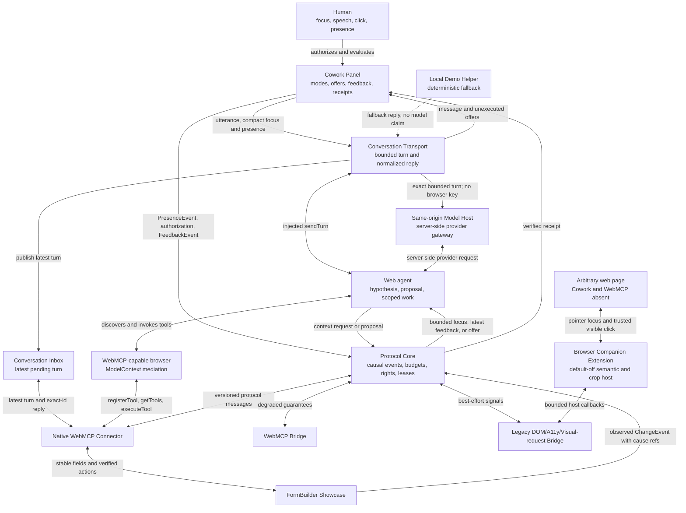
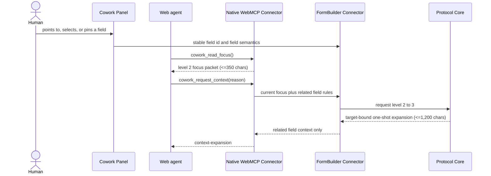
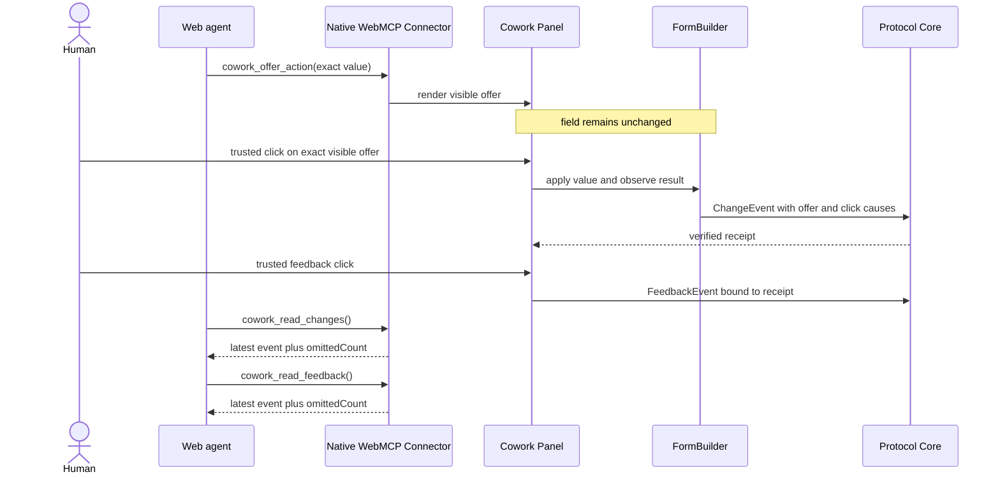
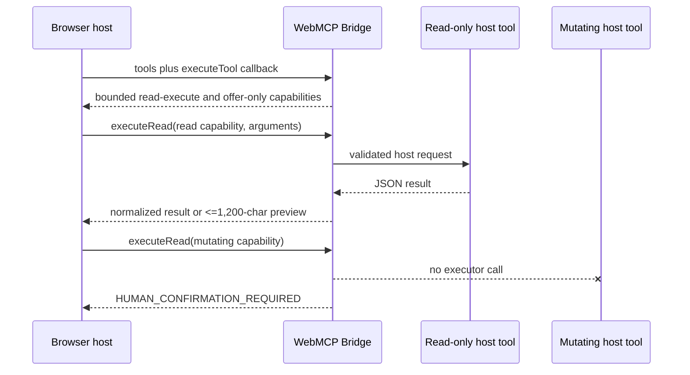
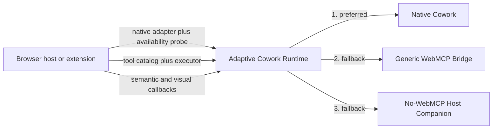
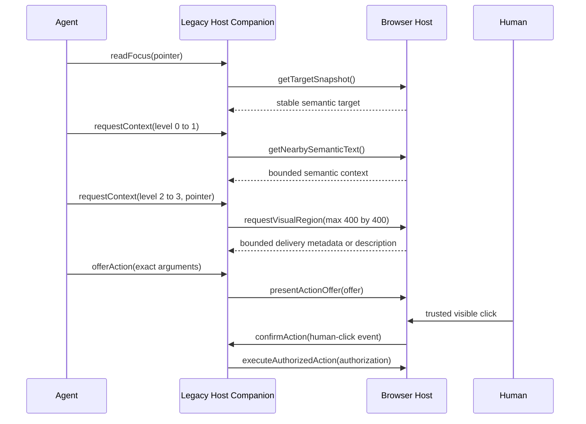

# Architecture

This UML-like C4 component view answers one question: which component owns context, authority and application-specific behavior?



Text alternative: the panel is the human control surface, the core enforces context and authority, and connectors translate application or browser data into the same protocol. A WebMCP-capable browser mediates discovery and invocation between the web agent and the native connector. The conversation transport accepts typed or spoken input through an injected host adapter, the same-origin model host, or a latest-only WebMCP pull inbox; the showcase uses a labeled deterministic helper when no host transport exists. The same-origin host validates the exact bounded turn and keeps provider endpoint, model ID and key on the server. Replies may describe offers, but only the panel can render them and only a human click can authorize them. FormBuilder reports value deltas as digest-based change events with explicit cause references. Only the native FormBuilder connector can promise stable targets and application-level verification. Bridge connectors must expose their reduced capability level.

The human authorization surface accepts only losslessly JSON-serializable action arguments. A FormBuilder offer displays the exact proposed value, limits it to 350 Unicode code points in both its WebMCP schema and runtime guard, and expires it from the DOM on a scheduled render; agent-generated events cannot authorize it.

## Bounded conversation to visible action offer

This sequence view answers one question: how can speech or typed input reach a preferred model without giving it the page or allowing it to act invisibly?

```mermaid
sequenceDiagram
  actor Human
  participant Panel as Cowork Panel
  participant Conversation as Conversation Transport
  participant WebMCP as Native WebMCP Connector
  participant Host as Host model adapter
  participant Model as Preferred model
  participant Form as FormBuilder

  Human->>Panel: speaks or submits text
  alt silence or agent paused
    Panel-->>Human: no transport call
  else bounded turn
    Panel->>Conversation: utterance + compact focus + presence (<=1,200 chars)
    alt injected or same-origin host available
      Conversation->>Host: sendTurn(exact turn)
      Host->>Model: provider-specific request
      Model-->>Host: message + optional offers
      Host-->>Conversation: provider-neutral reply
    else WebMCP agent pulls
      Conversation->>WebMCP: publish latest pending turn
      Model->>WebMCP: cowork_read_turn()
      WebMCP-->>Model: exact turn id + bounded turn
      Model->>WebMCP: cowork_reply_turn(turn id, reply)
      WebMCP-->>Conversation: bounded reply for latest turn
    else no model transport
      Conversation->>Conversation: deterministic local helper reply
    end
    Conversation-->>Panel: bounded reply; no execution right
    Panel-->>Human: message + exact visible offer
    Human->>Panel: trusted click on offer
    Panel->>Form: apply exact value and verify
    Form-->>Panel: verified receipt
  end
```

Text alternative: silence and Human Solo stop before the model boundary. An active turn contains only the utterance, current compact focus and presence, never page HTML. An injected adapter or same-origin server host may push the exact turn to a preferred model; provider configuration and credentials remain outside the browser. Otherwise an in-page WebMCP agent can pull only the latest pending turn and reply against its exact unique id; stale and replayed replies fail closed. With neither path, the labeled local helper exercises the same visible loop without claiming a connected external model. Every reply is capped and can describe at most three offers; an overlong proposed value fails closed. The FormBuilder changes only after the human clicks the exact visible offer and the result verifies.

The current [WebMCP draft specification](https://webmachinelearning.github.io/webmcp/) standardizes page tool registration and invocation, while browser-agent observation timing remains implementation-defined. It does not define a page-to-agent push-turn API. Cowork therefore keeps provider push behind the optional host `sendTurn` seam and uses the two ordinary WebMCP tools as its standards-shaped pull path.

Diagram type: UML sequence diagram. Source and renderer: the Mermaid block above. Scope: runtime conversation and authorization, not provider deployment. Source IDs: `packages/conversation/src/index.js`, `packages/model-transport/src/browser.js`, `packages/model-transport/src/openai-compatible.js`, `scripts/serve.mjs`, `packages/native-webmcp/src/index.js`, `apps/formbuilder-showcase/src/app.js`, and `apps/formbuilder-showcase/src/local-conversation.js`.

## One-shot adaptive context request

This UML-like sequence view answers one question: how can an agent obtain one useful field detail without receiving the page?



The request is read-only, must include a reason of at most 200 JavaScript UTF-16 code units, can expand by only one level, stays bound to the current target and page version, and returns at most 1,200 adapter code units. With attention off or without a stable current focus it fails closed. The response contains only related field semantics such as requiredness, help text and select options; it does not return the page or persist the expansion into later turns.

Diagram type: UML-like sequence diagram. Source and renderer: the Mermaid block above, rendered by compatible Markdown hosts. Fallback: the adjacent prose contract if Mermaid is unavailable. Scope: runtime interaction, not deployment topology.

## Click-gated native action and latest-only readback



The offer call can render intent but cannot grant authority. The visible value, target and page version must still match when the human clicks. The FormBuilder mutation is successful only after the observed value verifies; feedback is accepted only from a trusted click and carries the resulting change reference. Read tools return one latest event rather than replaying the collaboration history. The reproducible Chrome smoke performs this cycle twice and requires `omittedCount: 1` on both readbacks, proving that the browser path actually omits the older event.

## WebMCP bridge boundary

`packages/bridge` does not scrape a page or pretend that a producer-side API can enumerate every registered tool. A host must explicitly supply the tool catalog and executor. The bridge exposes only bounded summaries: at most 350 serialized JavaScript UTF-16 code units per capability, including a 160-code-unit description, at most 12 parameter names and at most 48 code units per included parameter name. If even an escaped tool identity cannot fit, only that declaration is rejected; valid neighboring tools remain available. Tools marked read-only by the host can cross the read executor; all other tools remain `offer-only` and must return to a visible human-authorization path. Small read results are normalized through a JSON round trip. A result larger than 1,200 adapter code units becomes a labeled JSON preview with source and included-unit metrics; the unbounded object is not forwarded. Missing schemas, duplicate names, malformed catalogs and unserializable results fail closed.

The isolated Chrome acceptance path now supplies a browser-owned calendar catalog and executor to the real bridge. It proves that the adapter runs in a browser host, bounds both catalog and read result, and blocks the mutating tool before host execution. It does not prove discovery or invocation on an unrelated live website.



Text alternative: the browser host owns discovery and supplies both catalog and executor. The bridge classifies effects and sends only read-only tools to the executor. Oversized read results become bounded previews. Mutating tools terminate at the visible-offer boundary and never reach the host executor through `executeRead`.

## Legacy bridge boundary

The exported adaptive runtime prioritizes three explicitly supplied host layers. It selects a native Cowork adapter when its probe succeeds, otherwise a generic WebMCP bridge with at least one usable capability, otherwise a legacy host companion. It never scans a browser or an unrelated page by itself. Probe failures and unusable layers become code-only diagnostics; if no layer is usable, negotiation fails closed.



Text alternative: the host supplies one or more adapters. Negotiation chooses native Cowork first, a usable generic WebMCP catalog second and the no-WebMCP companion third. No layer is inferred from unrestricted browser access.

The legacy companion accepts a host-provided semantic DOM/accessibility snapshot. A target without a stable ID is ephemeral and explain-only; a stable target may create a visible value offer but never directly mutate. Context expands one recorded tier at a time: 350 code units of nearby semantic text, 1,200 code units of an accessibility-region summary, then a request for a pointer-centered region no larger than 400×400 pixels. At the visual tier, the package invokes an explicit `requestVisualRegion` host callback and bounds the returned JSON delivery metadata or semantic description to 1,200 code units. The package itself does not capture pixels. The agent-facing adapter can present a visible action with `presentActionOffer` but has no confirmation method. Only the separate host surface accepts a matching, unexpired `human-click` confirmation and then reaches `executeAuthorizedAction`.

`apps/browser-companion` is one concrete host implementation. Its content script is inert until toggled on. It extracts the pointed semantic control, provides the two bounded text tiers, asks its service worker to capture the visible tab and immediately crops that bitmap to the 400×400 pointer request. The page-facing transport receives only the random reference and bounded metadata. Cropped bytes are consumable exactly once from the isolated extension host; arbitrary page JavaScript never receives the full screenshot or the crop. Stable text-like controls can receive visible exact-value offers, but password, file, hidden, ambiguous and unstable targets remain explain-only. An `isTrusted` click plus the core authorization contract gates execution and observed-value verification.



## Concrete no-WebMCP browser companion

```mermaid
sequenceDiagram
  actor Human
  participant Page as Arbitrary web page
  participant PageClient as Versioned page client
  participant Extension as Companion content runtime
  participant Companion as Legacy Host Companion
  participant Worker as Extension service worker
  participant ExtensionHost as Optional isolated host consumer

  Note over Page,Extension: document.modelContext is absent; extension starts off
  Human->>Extension: toolbar toggle on
  Human->>Page: point at a stable text control
  PageClient->>Extension: readFocus(pointer)
  Extension->>Companion: readFocus(pointer)
  Companion->>Extension: semantic target callback
  Extension-->>Companion: stable target plus bounded label
  Companion-->>Extension: bounded focus packet
  Extension-->>PageClient: bounded focus packet
  PageClient->>Extension: requestContext(0 to 1)
  Extension->>Companion: requestContext(0 to 1)
  Companion-->>Extension: at most 350 semantic characters
  Extension-->>PageClient: at most 350 semantic characters
  PageClient->>Extension: requestContext(1 to 2)
  Extension->>Companion: requestContext(1 to 2)
  Companion-->>Extension: at most 1,200 accessibility characters
  Extension-->>PageClient: at most 1,200 accessibility characters
  PageClient->>Extension: requestContext(2 to 3, pointer)
  Extension->>Companion: requestContext(2 to 3, pointer)
  Companion->>Worker: capture pointer region, max 400 by 400
  Worker->>Worker: capture visible tab, crop immediately, discard full image
  Worker-->>Extension: random one-shot crop reference and metadata
  Extension-->>PageClient: bounded reference and metadata only
  ExtensionHost->>Worker: consume crop reference once
  Worker-->>ExtensionHost: cropped PNG only
  PageClient->>Extension: offerAction(exact visible value)
  Extension->>Companion: offerAction(exact visible value)
  Companion->>Extension: render inert offer
  Human->>Extension: trusted click
  Extension->>Companion: confirmAction(human-click)
  Companion->>Page: set and observe exact value
  Page-->>Extension: verified value
  Human->>Extension: toolbar toggle off
```

Text alternative: on a page without WebMCP, the human explicitly enables the extension and points at one control. A versioned page client receives the smallest semantic tier first and must request each larger tier separately. At the visual tier it receives only bounded metadata and a random reference; the full visible capture exists only long enough to create a 400×400 crop. An isolated extension-side host API can consume that crop once, but no connected model client is claimed. A proposed field value remains unchanged until the human clicks the extension offer, after which the host applies and verifies the exact value. Toggling off removes the active surface.

## Source and scope

- Source IDs: package paths in this repository.
- Diagram source: this Mermaid block; keep it beside any later SVG export.
- Scope: logical components, not deployment topology.
- Relationships are designed contracts, not reverse-engineered claims. They must be reconciled with exported package APIs after each MVP milestone.
- Last reconciled with exported local APIs: 2026-08-30.
