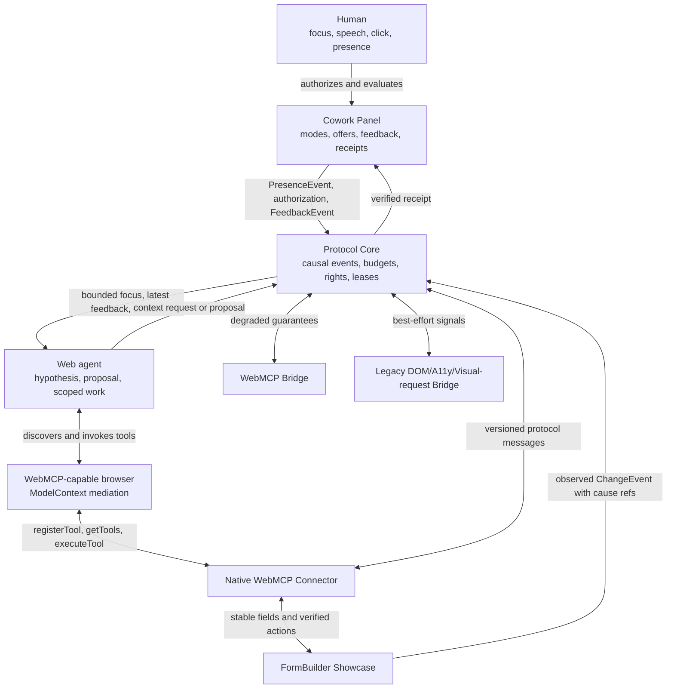
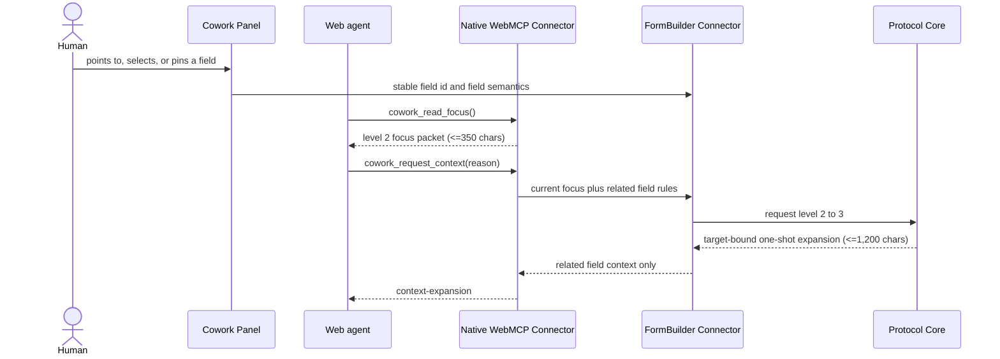
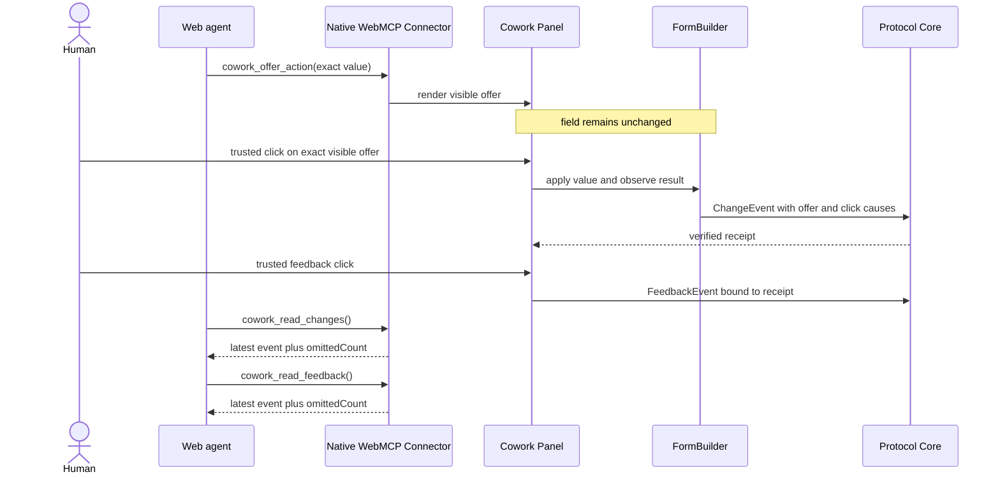

# Architecture

This UML-like C4 component view answers one question: which component owns context, authority and application-specific behavior?

Text alternative: the panel is the human control surface, the core enforces context and authority, and connectors translate application or browser data into the same protocol. A WebMCP-capable browser mediates discovery and invocation between the web agent and the native connector. FormBuilder reports value deltas as digest-based change events with explicit cause references. After a receipt, a real human click creates feedback; the native tool returns only the latest bounded feedback event to the agent. Only the native FormBuilder connector can promise stable targets and application-level verification. Bridge connectors must expose their reduced capability level.

The human authorization surface accepts only losslessly JSON-serializable action arguments. A FormBuilder offer displays the exact proposed value, limits it to 350 Unicode code points in both its WebMCP schema and runtime guard, and expires it from the DOM on a scheduled render; agent-generated events cannot authorize it.

## One-shot adaptive context request

This UML-like sequence view answers one question: how can an agent obtain one useful field detail without receiving the page?

The request is read-only, must include a reason of at most 200 JavaScript UTF-16 code units, can expand by only one level, stays bound to the current target and page version, and returns at most 1,200 adapter code units. With attention off or without a stable current focus it fails closed. The response contains only related field semantics such as requiredness, help text and select options; it does not return the page or persist the expansion into later turns.

Diagram type: UML-like sequence diagram. Source and renderer: the Mermaid block above, rendered by compatible Markdown hosts. Fallback: the adjacent prose contract if Mermaid is unavailable. Scope: runtime interaction, not deployment topology.

## Click-gated native action and latest-only readback

The offer call can render intent but cannot grant authority. The visible value, target and page version must still match when the human clicks. The FormBuilder mutation is successful only after the observed value verifies; feedback is accepted only from a trusted click and carries the resulting change reference. Read tools return one latest event rather than replaying the collaboration history. The reproducible Chrome smoke performs this cycle twice and requires `omittedCount: 1` on both readbacks, proving that the browser path actually omits the older event.

## WebMCP bridge boundary

`packages/bridge` does not scrape a page or pretend that a producer-side API can enumerate every registered tool. A host must explicitly supply the tool catalog and executor. The bridge exposes only bounded summaries: at most 350 serialized JavaScript UTF-16 code units per capability, including a 160-code-unit description, at most 12 parameter names and at most 48 code units per included parameter name. If even an escaped tool identity cannot fit, only that declaration is rejected; valid neighboring tools remain available. Tools marked read-only by the host can cross the read executor; all other tools remain `offer-only` and must return to a visible human-authorization path. Small read results are normalized through a JSON round trip. A result larger than 1,200 adapter code units becomes a labeled JSON preview with source and included-unit metrics; the unbounded object is not forwarded. Missing schemas, duplicate names, malformed catalogs and unserializable results fail closed.

This completes a portable adapter contract, not a live foreign-site discovery result. Host discovery and invocation still require a browser-owned integration and an acceptance test.

## Legacy bridge boundary

The legacy path accepts a host-provided semantic DOM/accessibility snapshot. A target without a stable ID is ephemeral and explain-only; a stable target may create a visible value offer but never directly mutate. Context expands one tier at a time: 350 code units of nearby semantic text, 1,200 code units of an accessibility-region summary, then a request for a pointer-centered region no larger than 400×400 pixels. Text truncation never splits a UTF-16 surrogate pair. The package returns the request descriptor, not image bytes. Capturing and delivering that region is a separate browser-host responsibility and remains unverified.

## Source and scope

- Source IDs: package paths in this repository.
- Diagram source: this Mermaid block; keep it beside any later SVG export.
- Scope: logical components, not deployment topology.
- Relationships are designed contracts, not reverse-engineered claims. They must be reconciled with exported package APIs after each MVP milestone.
- Last reconciled with exported local APIs: 2026-08-30.
