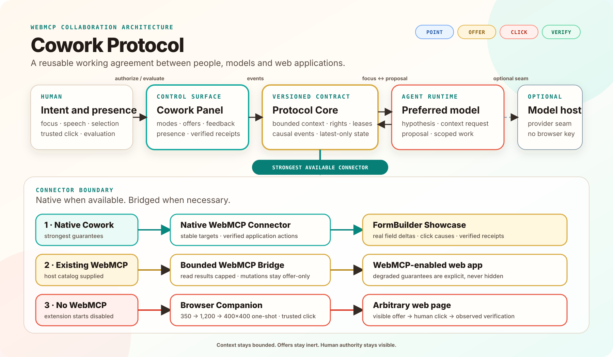
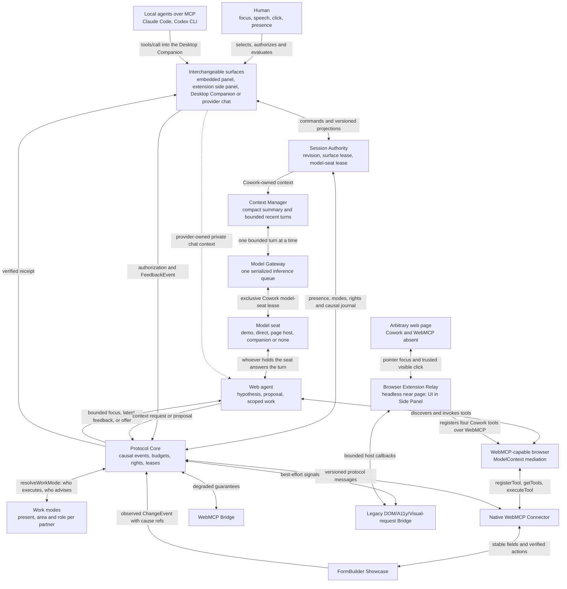
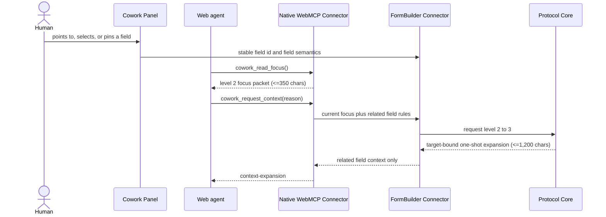
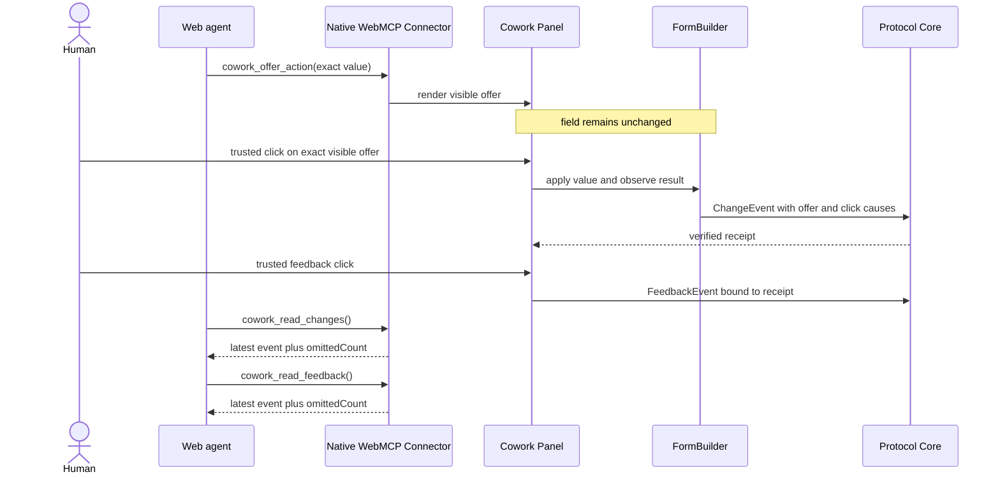
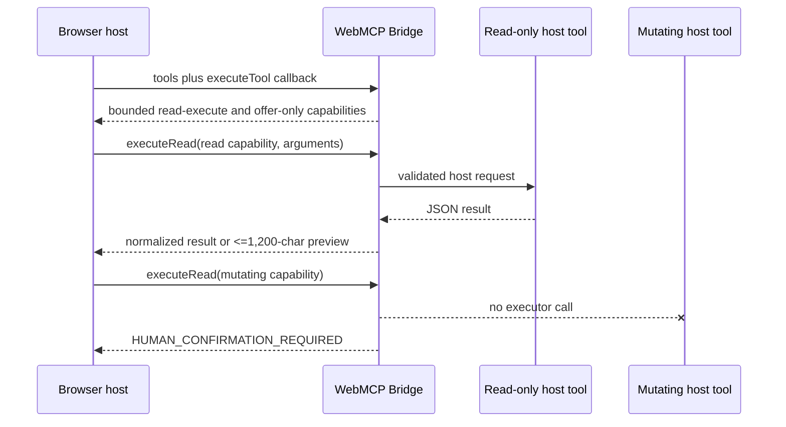
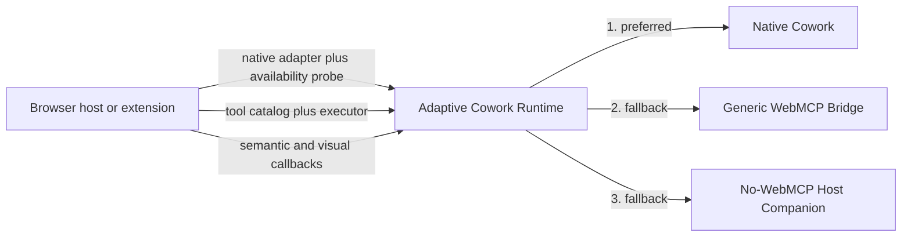
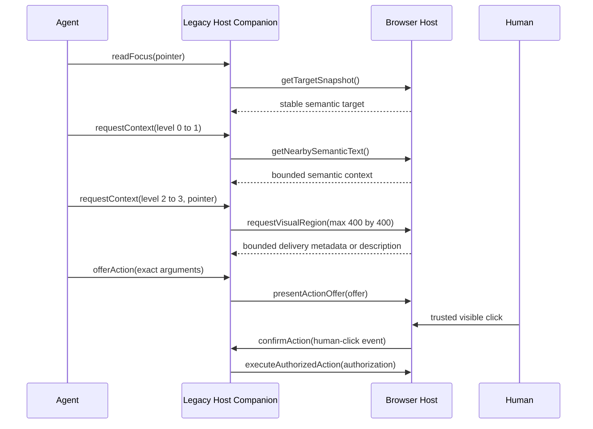

# Architecture

The accepted [post-audit session architecture](post-audit-session-architecture.md)
separates the headless, provider-neutral protocol from every UI. A website may
choose protocol only, protocol plus an automatically mounted UI, or protocol
plus a user-activated optional UI. External surfaces such as a browser Side
Panel, desktop Companion or deliberately selected third-party provider chat
can consume the protocol without being inserted into the website. Cowork-owned
surfaces share one Session Authority; a provider chat remains its own
conversation authority instead of pretending that private provider context is
ours. The diagrams below distinguish this accepted direction from the parts
already implemented and browser-tested.

This UML-like C4 component view answers one question: which component owns context, authority and application-specific behavior?



The overview above is the compact submission view: one protocol, one human
surface, three hosts. Each partner answers three questions -- present, working
on what, in which role -- and the resulting work mode
([work-modes.md](work-modes.md)) names who may click; a model executes only
inside a grant or lease. The same human surface is rendered by an embedded
panel, the extension side panel or the Desktop Companion, and one panel serves
both halves of the showcase page: FormBuilder Studio above and the sample form
below. One versioned Session Authority and one serialized gateway feed the
single active model seat, which resolves to a scripted demo helper, a direct
OpenAI-compatible connection, a same-origin page host, the connected Companion,
or nothing at all. The Protocol Core then selects the strongest connector the
current page actually provides. Where no page connector exists, the extension
relay stays bounded to the browser and registers the Cowork tools over WebMCP
on that foreign page, and the Desktop Companion may invoke Open Compute as a
filtered fallback through a semantic-first token profile with an explicitly
signaled visual escalation. The Mermaid views below remain the source-backed
engineering detail and text alternatives.



Text alternative: the visible surface is replaceable. Every Cowork-owned
surface reads and writes one versioned Session Authority; one Context Manager
stores only a compact summary and recent bounded turns, and one Model Gateway
serializes inference under an exclusive renewable model-seat lease. That one
active seat resolves to a scripted demo helper, a direct OpenAI-compatible
connection, a same-origin page host, the connected Desktop Companion, or
nothing at all, and local agents such as Claude Code or Codex CLI reach the
Companion as an MCP tool server. A foreign provider chat may use the Protocol
Core while retaining its private context.
The core enforces modes, rights and causal events, while connectors translate
application or browser data into the same contract. Those modes are not a
separate setting: three answers per partner, present, working on what and in
which role, resolve to the work mode and with it to the right to click. A
WebMCP-capable browser mediates discovery and invocation between the web agent
and the native connector; on a page that ships no tools of its own, the
extension registers four Cowork tools over WebMCP so the same agents can still
read focus and propose. Replies may describe offers, but only a compatible human-facing
surface can render them and only an explicit human authorization can approve
them. FormBuilder reports value deltas as digest-based change events with
explicit cause references. Only its native connector can promise stable
targets and application-level verification; bridge connectors expose their
reduced capability level.

`packages/integration-contract` makes this split executable. Its declarations
contain no preferred UI vendor. The site selects only its in-page presentation
policy and, where applicable, the UI provider it intends to mount. An external
surface negotiates protocol access without a page mount. A cooperating website
may still select and embed the Cowork reference UI as an ordinary consumer,
which is exactly what the FormBuilder showcase declares. The Cowork extension
uses the browser-owned Side Panel supported by
[Chrome](https://developer.chrome.com/docs/extensions/reference/api/sidePanel)
and [Microsoft Edge](https://learn.microsoft.com/en-us/microsoft-edge/extensions/developer-guide/sidebar);
the content script remains a relay or bounded fallback adapter rather than a
visual panel inside the website. Page embedding and extension injection are
therefore separate decisions, not mutually exclusive product paths.

`packages/session-authority`, `packages/context-manager`,
`packages/model-gateway` and `packages/companion-link` implement the shared
Cowork-owned path. FormBuilder may begin as temporary authority, detach the
same DOM surface into Document Picture-in-Picture and then send one exact
snapshot plus compact context to the loopback Companion. The Companion records
the surface handoff and model-seat claim as two contiguous deltas, persists the
session, and becomes the only inference path. Its independently movable
Edge/Chrome app window and Windows tray are presentation clients of that same
process. The embedded UI collapses and disables its model input but remains an
application/UI replica that can pull later deltas. While connected, page
visibility crosses the link only as a bounded `page-hidden` or `page-visible`
SurfaceEvent with the replica's last revision. The page reports its current
state once immediately after join and then only on changes. It contains no page
content and does not call the model. On return, the page pulls every ordered
delta after its cursor before rendering again. Browser Local Network Access permission is
still explicitly granted by the human.

## Token-free page handoff and return

This UML sequence view answers one question: how does the Companion notice a
tab change and reconcile work performed while the page was hidden without a
history replay or model turn?

```mermaid
sequenceDiagram
  actor Human
  participant Page as FormBuilder replica
  participant Link as Loopback Companion Link
  participant Authority as Companion Session Authority
  participant Surface as Companion UI/tray
  participant Gateway as Model Gateway

  Human->>Page: changes tab
  Page->>Link: SurfaceEvent(page-hidden, last revision)
  Link->>Authority: validate origin, session, surface and cursor
  Authority-->>Surface: revisioned surface-visibility delta
  Note over Link,Gateway: no page content and no model call
  Authority->>Authority: optional authorized background work
  Human->>Page: returns to tab
  Page->>Link: SurfaceEvent(page-visible, last revision)
  Link->>Authority: validate and append current visibility
  Page->>Link: pullDeltas(after last revision)
  Link-->>Page: ordered hidden, background-work and visible deltas
  Page->>Page: apply complete batch and render current revision
```

Text alternative: after Companion handoff, the page reports its initial
visibility once; each later tab change sends only the joined surface ID, one of
two visibility states and the page replica's integer cursor.
The loopback host rejects another surface, another origin or a cursor ahead of
the authority. The signal updates the causal journal and the Companion's page
indicator but never enters the Model Gateway. When the page becomes visible,
its serialized signal queue first records that transition and then pulls all
deltas after its old cursor, including any authorized Companion work completed
while hidden.

Diagram type: UML sequence diagram. Source and renderer: the Mermaid block
above. Scope: connected page visibility and delta reconciliation, not operating
system window activation. Source IDs: `packages/companion-link/src/index.js`,
`apps/desktop-companion/src/host.js`,
`apps/formbuilder-showcase/src/app.js`, and
`scripts/session-surface-browser-smoke.mjs`. Reconciled: 2026-08-31.

The optional extension uses two execution worlds for Native-first behavior.
A trusted toolbar action or `_execute_action` shortcut grants temporary
`activeTab` access; the manifest has no persistent host permission and no
automatic content scripts. Only then can a minimal main-world bridge reach the page-owned
`document.modelContext`; all visual and privileged extension work remains in
the isolated extension world and Side Panel. If native Cowork tools exist, the
extension invokes them directly and never starts its legacy fallback. If the
page exposes no WebMCP, the separate bounded fallback path below applies.

The human authorization surface accepts only losslessly JSON-serializable action arguments. A FormBuilder offer displays the exact proposed value, limits it to 350 Unicode code points in both its WebMCP schema and runtime guard, and expires it from the DOM on a scheduled render; agent-generated events cannot authorize it.

## Bounded conversation to visible action offer

This sequence view answers one question: how can speech or typed input reach a preferred model without giving it the page or allowing it to act invisibly?

```mermaid
sequenceDiagram
  actor Human
  participant Panel as Cowork Panel
  participant Conversation as Conversation Transport
  participant WebMCP as Native WebMCP Connector
  participant Host as Host model adapter
  participant Model as Preferred model
  participant Form as FormBuilder

  Human->>Panel: speaks or submits text
  alt silence or agent paused
    Panel-->>Human: no transport call
  else bounded turn
    Panel->>Conversation: utterance + compact focus + presence (<=1,200 chars)
    alt injected or same-origin host available
      Conversation->>Host: sendTurn(exact turn)
      Host->>Model: provider-specific request
      Model-->>Host: message + optional offers
      Host-->>Conversation: provider-neutral reply
    else WebMCP agent pulls
      Conversation->>WebMCP: publish latest pending turn
      Model->>WebMCP: cowork_read_turn()
      WebMCP-->>Model: exact turn id + bounded turn
      Model->>WebMCP: cowork_reply_turn(turn id, reply)
      WebMCP-->>Conversation: bounded reply for latest turn
    else no model transport
      Conversation->>Conversation: deterministic local helper reply
    end
    Conversation-->>Panel: bounded reply; no execution right
    Panel-->>Human: message + exact visible offer
    Human->>Panel: trusted click on offer
    Panel->>Form: apply exact value and verify
    Form-->>Panel: verified receipt
  end
```

Text alternative: silence and Human Solo stop before the model boundary. An active turn contains only the utterance, current compact focus and presence, never page HTML. An injected adapter or same-origin server host may push the exact turn to a preferred model; provider configuration and credentials remain outside the browser. Otherwise an in-page WebMCP agent can pull only the latest pending turn and reply against its exact unique id; stale and replayed replies fail closed. With neither path, the labeled local helper exercises the same visible loop without claiming a connected external model. Every reply is capped and can describe at most three offers; an overlong proposed value fails closed. The FormBuilder changes only after the human clicks the exact visible offer and the result verifies.

The current [WebMCP draft specification](https://webmachinelearning.github.io/webmcp/) standardizes page tool registration and invocation, while browser-agent observation timing remains implementation-defined. It does not define a page-to-agent push-turn API. Cowork therefore keeps provider push behind the optional host `sendTurn` seam and uses the two ordinary WebMCP tools as its standards-shaped pull path.

Diagram type: UML sequence diagram. Source and renderer: the Mermaid block above. Scope: runtime conversation and authorization, not provider deployment. Source IDs: `packages/conversation/src/index.js`, `packages/model-transport/src/browser.js`, `packages/model-transport/src/openai-compatible.js`, `scripts/serve.mjs`, `packages/native-webmcp/src/index.js`, `apps/formbuilder-showcase/src/app.js`, and `apps/formbuilder-showcase/src/local-conversation.js`.

## One-shot adaptive context request

This UML-like sequence view answers one question: how can an agent obtain one useful field detail without receiving the page?



The request is read-only, must include a reason of at most 200 JavaScript UTF-16 code units, can expand by only one level, stays bound to the current target and page version, and returns at most 1,200 adapter code units. With attention off or without a stable current focus it fails closed. The response contains only related field semantics such as requiredness, help text and select options; it does not return the page or persist the expansion into later turns.

Diagram type: UML-like sequence diagram. Source and renderer: the Mermaid block above, rendered by compatible Markdown hosts. Fallback: the adjacent prose contract if Mermaid is unavailable. Scope: runtime interaction, not deployment topology.

## Click-gated native action and latest-only readback



The offer call can render intent but cannot grant authority. The visible value, target and page version must still match when the human clicks. The FormBuilder mutation is successful only after the observed value verifies; feedback is accepted only from a trusted click and carries the resulting change reference. Read tools return one latest event rather than replaying the collaboration history. The reproducible Chrome smoke performs this cycle twice and requires `omittedCount: 1` on both readbacks, proving that the browser path actually omits the older event.

## WebMCP bridge boundary

`packages/bridge` does not scrape a page or pretend that a producer-side API can enumerate every registered tool. A host must explicitly supply the tool catalog and executor. The bridge exposes only bounded summaries: at most 350 serialized JavaScript UTF-16 code units per capability, including a 160-code-unit description, at most 12 parameter names and at most 48 code units per included parameter name. If even an escaped tool identity cannot fit, only that declaration is rejected; valid neighboring tools remain available. Tools marked read-only by the host can cross the read executor; all other tools remain `offer-only` and must return to a visible human-authorization path. Small read results are normalized through a JSON round trip. A result larger than 1,200 adapter code units becomes a labeled JSON preview with source and included-unit metrics; the unbounded object is not forwarded. Missing schemas, duplicate names, malformed catalogs and unserializable results fail closed.

The isolated Chrome acceptance path now supplies a browser-owned calendar catalog and executor to the real bridge. It proves that the adapter runs in a browser host, bounds both catalog and read result, and blocks the mutating tool before host execution. It does not prove discovery or invocation on an unrelated live website.



Text alternative: the browser host owns discovery and supplies both catalog and executor. The bridge classifies effects and sends only read-only tools to the executor. Oversized read results become bounded previews. Mutating tools terminate at the visible-offer boundary and never reach the host executor through `executeRead`.

## Legacy bridge boundary

The exported adaptive runtime prioritizes three explicitly supplied host layers. It selects a native Cowork adapter when its probe succeeds, otherwise a generic WebMCP bridge with at least one usable capability, otherwise a legacy host companion. It never scans a browser or an unrelated page by itself. Probe failures and unusable layers become code-only diagnostics; if no layer is usable, negotiation fails closed.



Text alternative: the host supplies one or more adapters. Negotiation chooses native Cowork first, a usable generic WebMCP catalog second and the no-WebMCP companion third. No layer is inferred from unrestricted browser access.

The legacy companion accepts a host-provided semantic DOM/accessibility snapshot. A target without a stable ID is ephemeral and explain-only; a stable target may create a visible value offer but never directly mutate. Context expands one recorded tier at a time: 350 code units of nearby semantic text, 1,200 code units of an accessibility-region summary, then a request for a pointer-centered region no larger than 400×400 pixels. At the visual tier, the package invokes an explicit `requestVisualRegion` host callback and bounds the returned JSON delivery metadata or semantic description to 1,200 code units. The package itself does not capture pixels. The agent-facing adapter can present a visible action with `presentActionOffer` but has no confirmation method. Only the separate host surface accepts a matching, unexpired `human-click` confirmation and then reaches `executeAuthorizedAction`.

`apps/browser-companion` is one concrete host implementation. Its content script is inert until toggled on. It extracts the pointed semantic control, provides the two bounded text tiers, asks its service worker to capture the visible tab and immediately crops that bitmap to the 400×400 pointer request. The page-facing transport receives only the random reference and bounded metadata. Cropped bytes are consumable exactly once from the isolated extension host; arbitrary page JavaScript never receives the full screenshot or the crop. Stable text-like controls can receive visible exact-value offers, but password, file, hidden, ambiguous and unstable targets remain explain-only. An `isTrusted` click plus the core authorization contract gates execution and observed-value verification.



## Concrete no-WebMCP browser companion

```mermaid
sequenceDiagram
  actor Human
  participant Page as Arbitrary web page
  participant PageClient as Versioned page client
  participant Extension as Companion content runtime
  participant Companion as Legacy Host Companion
  participant Worker as Extension service worker
  participant ExtensionHost as Optional isolated host consumer

  Note over Page,Extension: document.modelContext is absent; extension starts off
  Human->>Extension: toolbar toggle on
  Human->>Page: point at a stable text control
  PageClient->>Extension: readFocus(pointer)
  Extension->>Companion: readFocus(pointer)
  Companion->>Extension: semantic target callback
  Extension-->>Companion: stable target plus bounded label
  Companion-->>Extension: bounded focus packet
  Extension-->>PageClient: bounded focus packet
  PageClient->>Extension: requestContext(0 to 1)
  Extension->>Companion: requestContext(0 to 1)
  Companion-->>Extension: at most 350 semantic characters
  Extension-->>PageClient: at most 350 semantic characters
  PageClient->>Extension: requestContext(1 to 2)
  Extension->>Companion: requestContext(1 to 2)
  Companion-->>Extension: at most 1,200 accessibility characters
  Extension-->>PageClient: at most 1,200 accessibility characters
  PageClient->>Extension: requestContext(2 to 3, pointer)
  Extension->>Companion: requestContext(2 to 3, pointer)
  Companion->>Worker: capture pointer region, max 400 by 400
  Worker->>Worker: capture visible tab, crop immediately, discard full image
  Worker-->>Extension: random one-shot crop reference and metadata
  Extension-->>PageClient: bounded reference and metadata only
  ExtensionHost->>Worker: consume crop reference once
  Worker-->>ExtensionHost: cropped PNG only
  PageClient->>Extension: offerAction(exact visible value)
  Extension->>Companion: offerAction(exact visible value)
  Companion->>Extension: render inert offer
  Human->>Extension: trusted click
  Extension->>Companion: confirmAction(human-click)
  Companion->>Page: set and observe exact value
  Page-->>Extension: verified value
  Human->>Extension: toolbar toggle off
```

Text alternative: on a page without WebMCP, the human explicitly enables the extension and points at one control. A versioned page client receives the smallest semantic tier first and must request each larger tier separately. At the visual tier it receives only bounded metadata and a random reference; the full visible capture exists only long enough to create a 400×400 crop. An isolated extension-side host API can consume that crop once, but no connected model client is claimed. A proposed field value remains unchanged until the human clicks the extension offer, after which the host applies and verifies the exact value. Toggling off removes the active surface.

## Source and scope

- Source IDs: package paths in this repository.
- Diagram source: this Mermaid block; keep it beside any later SVG export.
- Scope: logical components, not deployment topology.
- Relationships are designed contracts, not reverse-engineered claims. They must be reconciled with exported package APIs after each MVP milestone.
- Last reconciled with exported local APIs: 2026-08-30. The overview image and
  the component view above now both carry the two later changes: the work-mode
  matrix that replaced the action-rights setting (`resolveWorkMode()` in
  `packages/core`, v0.2.1), and the extension route in which the extension
  registers four Cowork tools itself on a page that has none
  (`bridge-webmcp`). They are described in [work-modes.md](work-modes.md) and
  [apps/browser-companion/README.md](../apps/browser-companion/README.md). The
  sequence diagrams below predate both and show neither.
