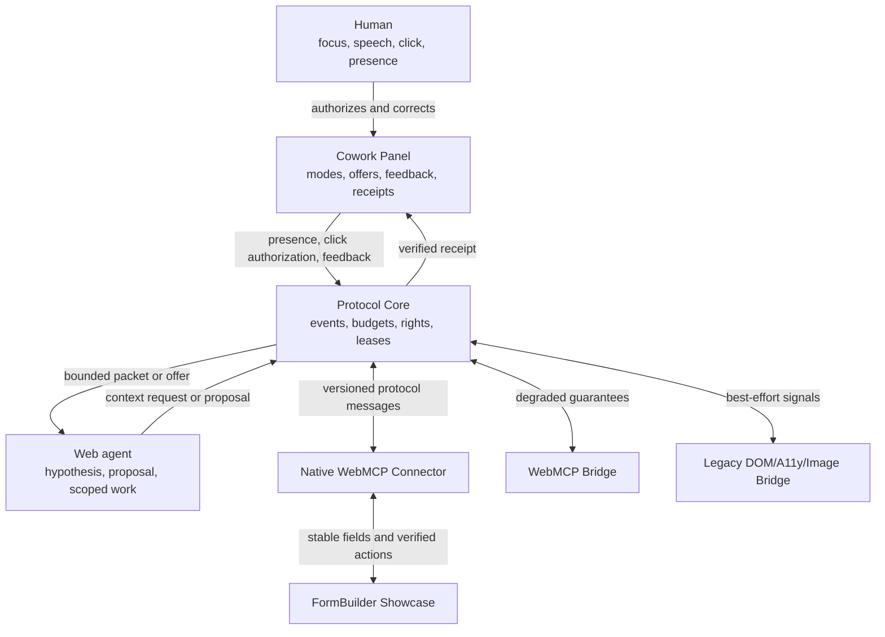

# Architecture

This UML-like C4 component view answers one question: which component owns context, authority and application-specific behavior?

Text alternative: the panel is the human control surface, the core enforces context and authority, and connectors translate application or browser data into the same protocol. Only the native FormBuilder connector can promise stable targets and application-level verification. Bridge connectors must expose their reduced capability level.

## Source and scope

- Source IDs: package paths in this repository.
- Diagram source: this Mermaid block; keep it beside any later SVG export.
- Scope: logical components, not deployment topology.
- Relationships are designed contracts, not reverse-engineered claims. They must be reconciled with exported package APIs after each MVP milestone.
