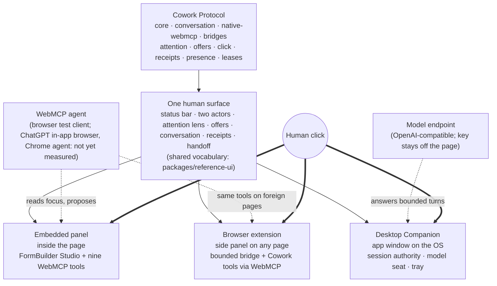

# Three in one: one protocol, one human surface, three hosts

Cowork Protocol is the submission. Everything else in this repository exists to
show that the protocol holds up wherever the human happens to be. This page
states that split in one place, says what each part adds, and is honest about
what each part cannot do.

Every arrow into a host ends at the same place: a person's real click. No host
lets a model authorize its own proposal.

## The protocol

`packages/core`, `packages/conversation`, `packages/native-webmcp` and the
bridge packages define the contract: bounded attention, offers that stay inert
until a real click, verified receipts, explicit presence, scoped leases and
grants, latest-only readback, and the work-mode matrix
([work-modes.md](./work-modes.md)). None of it depends on a particular user
interface, browser, or model vendor. A site can adopt the protocol without any
of the surfaces below; that is the point of a protocol.

## The human surface

The protocol needs one place where a person sees what the model sees, what it
proposes, and where the click happens. That surface is the Cowork panel:
status bar (present · working on · role), the two actors, attention lens,
offers, conversation, receipts, handoff. `packages/reference-ui` carries the
shared vocabulary so every host says the same words for the same state.

## Three hosts for that surface

| Host | Where the surface lives | What it adds to the protocol | What it does not do |
| --- | --- | --- | --- |
| Embedded panel | Inside the page (`apps/formbuilder-showcase`) | The reference integration: FormBuilder Studio is a complete product on its own, and the panel is attached to it as a guest. Registers the nine native WebMCP tools. | Nothing beyond the page it is embedded in. |
| Browser extension | Chrome/Edge side panel (`apps/browser-companion`) | Reach. The same surface on pages that do not ship Cowork or WebMCP: a bounded DOM/accessibility bridge, and Cowork tools registered through WebMCP on such pages so any WebMCP-capable agent can read focus and propose while the click stays in the panel. | It carries no model seat of its own. On a Cowork page it relays the page's tools; it never replaces the page's panel. |
| Desktop Companion | An app window on the operating system (`apps/desktop-companion`) | Freedom. Session authority outside the browser, a model seat whose endpoint and key never enter a page, presence in the tray, and a filtered Computer Use fallback. | It is not a browser agent and does not discover sites on its own; a page has to link to it. |

The FormBuilder Studio page is the vehicle, not the product: building a form
is a task where "who is present, who is acting, on what" matters minute by
minute, which is exactly what the protocol models.

## Why not one host

A protocol that only worked inside pages that adopted it would be a widget. A
protocol that only worked through an extension would be a browser feature. A
protocol that only worked through a desktop app would be a vendor client. The
three hosts exist to show the same contract holding in all three places — and
the cost of that is real: every change to the surface has to land in all three
at once. Where that cost is not worth paying, the host stays small and the
protocol stays the focus.

## What is claimed and what is not

Claims are measured in [evidence.md](./evidence.md). In short: the embedded
panel and its nine tools are accepted in Chrome 152 with a browser test client;
the extension is accepted on fixture pages with the same client; the Desktop
Companion is accepted with a local preferred model over an OpenAI-compatible
endpoint. A connected third-party agent (a ChatGPT in-app browser, Claude in
Chrome, or a local CLI agent over MCP) is not claimed until one has been
measured.
