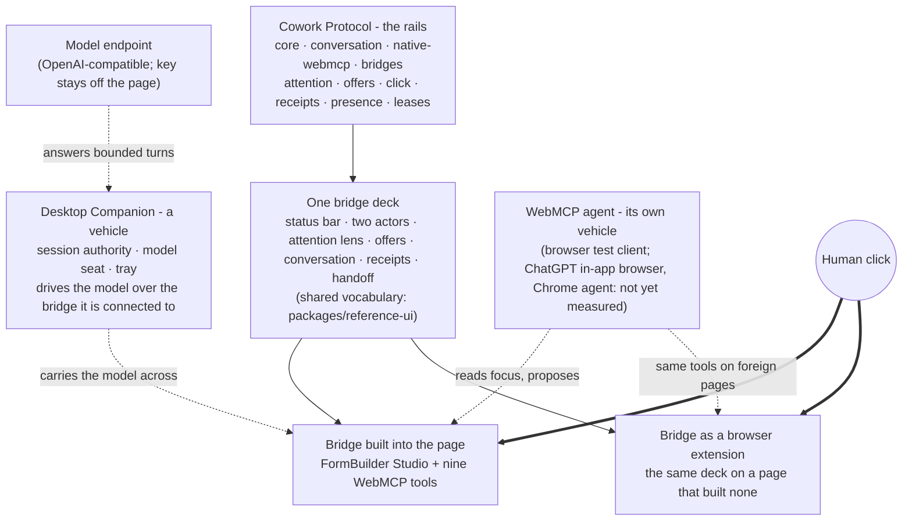

# Three in one: two bridges with a place, one vehicle

Cowork Protocol is the submission. Everything else in this repository exists to
show that the protocol holds up wherever the human happens to be. The parts are
easy to mix up because they look alike on screen, so this page separates them by
what they *are*, not by where their code lives.

**A bridge has a place.** It sits between one page and one model, and it is
where the human sees what the model sees and where the click happens. There are
two of them, and they are the same bridge twice: the panel the page builds in
itself, and the browser extension that carries the same bridge onto pages that
built none.

**A vehicle carries the model across.** The Desktop Companion is not a third
bridge. It holds the model seat and the session authority, and it drives that
model over whichever bridge it is connected to. Any WebMCP-capable agent brings
its own vehicle in the same way.

**Only what runs on the rails crosses.** The rails are the protocol: bounded
attention, offers that stay inert, a real click, a verified receipt. An agent
that does not speak it does not cross, and a bridge with nothing on it says so
in plain words — *No model is crossing the bridge.*

Every arrow into a bridge ends at the same place: a person's real click. No
vehicle authorizes its own proposal, whichever bridge it drives over.

## The protocol

`packages/core`, `packages/conversation`, `packages/native-webmcp` and the
bridge packages define the contract: bounded attention, offers that stay inert
until a real click, verified receipts, explicit presence, scoped leases and
grants, latest-only readback, and the work-mode matrix
([work-modes.md](./work-modes.md)). None of it depends on a particular user
interface, browser, or model vendor. A site can adopt the protocol without any
of the surfaces below; that is the point of a protocol.

## The bridge deck

Every bridge needs one place where a person sees what the model sees, what it
proposes, and where the click happens. That deck is the Cowork panel: status bar
(present · working on · role), the two actors, attention lens, offers,
conversation, receipts, handoff. `packages/reference-ui` carries the shared
vocabulary, which is why both bridges say the same words for the same state and
why a vehicle finds the same controls wherever it crosses.

## Two bridges, one vehicle, and the protocol underneath

| Level | What it is | Where it sits | What it adds | What it is not |
| --- | --- | --- | --- | --- |
| 1a | The protocol alone | Your own app, your own UI (`packages/*`) | The contract without a single Cowork pixel. A site can adopt it and draw its own surface. | Not a bridge yet: nothing here shows a person what is happening. |
| 1b | Bridge built into the page | Inside the page (`apps/formbuilder-showcase`) | The reference integration. FormBuilder Studio is a complete product on its own and the bridge is attached to it as a guest, registering the nine native WebMCP tools. | Not a vehicle: it carries no model of its own, so it stays empty until one arrives. |
| 2 | Bridge as a browser extension | Chrome/Edge side panel (`apps/browser-companion`) | Reach. The same deck on pages that never built one, with a bounded DOM/accessibility view and Cowork tools registered over WebMCP so any WebMCP agent can read focus and propose. | Not a second product and not a vehicle. On a page that carries its own bridge it steps aside; it never replaces the page's panel. |
| 3 | Desktop Companion, the vehicle | An app window on the operating system (`apps/desktop-companion`) | Freedom. Session authority outside the browser, a model seat whose endpoint and key never enter a page, presence in the tray, and a filtered Computer Use fallback. | Not a bridge. It has no page of its own; it drives the model over a bridge a page or the extension provides. |

Levels 1b and 2 are the same bridge in two places. Level 3 is what crosses it.
Level 1a is the rails with no bridge built on them yet.

FormBuilder Studio is the demonstration, not the product: building a form is a
task where "who is present, who is acting, on what" matters minute by minute,
which is exactly what the protocol models.

## Why two bridges and not one

A protocol that only worked inside pages that adopted it would be a widget. A
protocol that only reached pages through an extension would be a browser
feature. Building the bridge twice is what shows it is neither: the same deck,
once where a page invites it and once where a page knows nothing about it. The
cost is real — every change to the deck has to land in both places at once —
and where that cost is not worth paying, the bridge stays small and the
protocol stays the focus.

The Desktop Companion is not a third copy of that argument. It answers a
different question: whether the model seat can sit outside the browser
entirely, with its endpoint and key never touching a page.

## What is claimed and what is not

Claims are measured in [evidence.md](./evidence.md). In short: the page-built
bridge and its nine tools are accepted in Chrome 152 with a browser test client;
the extension bridge is accepted on fixture pages with the same client; the Desktop
Companion is accepted with a local preferred model over an OpenAI-compatible
endpoint. A connected third-party agent (a ChatGPT in-app browser, Claude in
Chrome, or a local CLI agent over MCP) is not claimed until one has been
measured.
