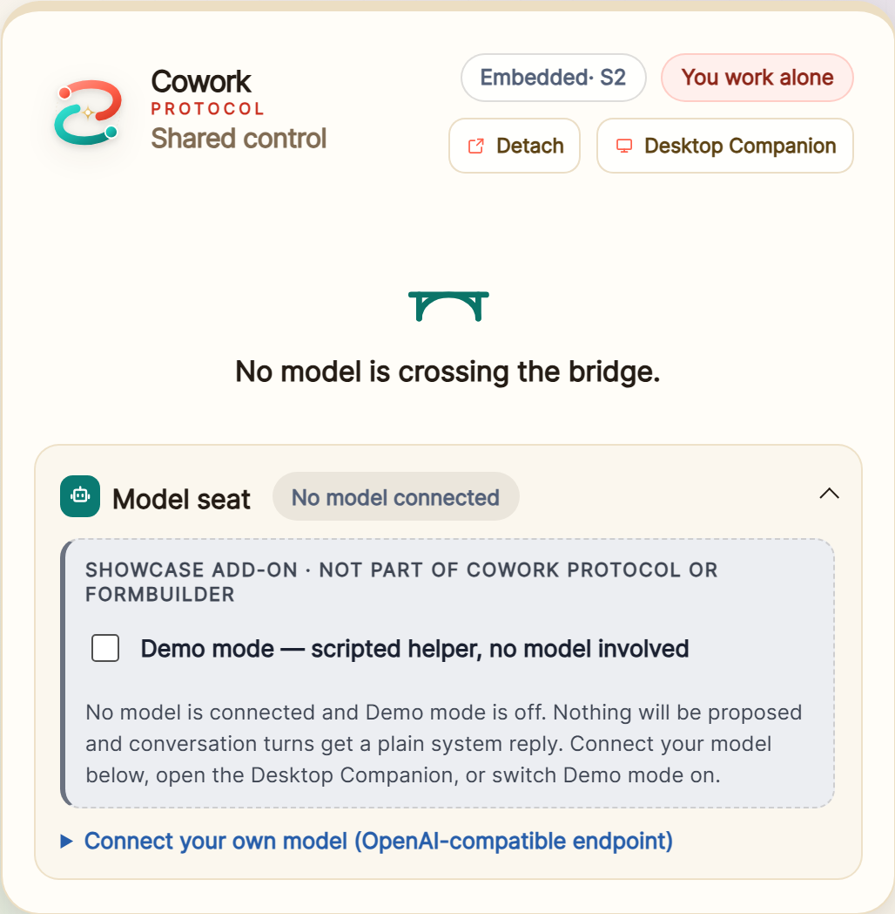
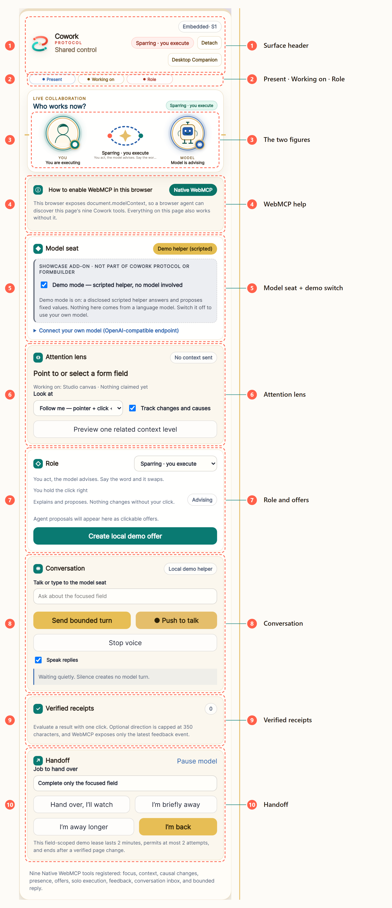
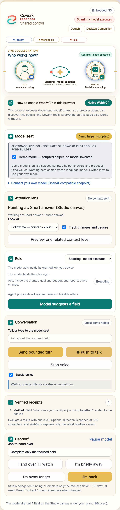
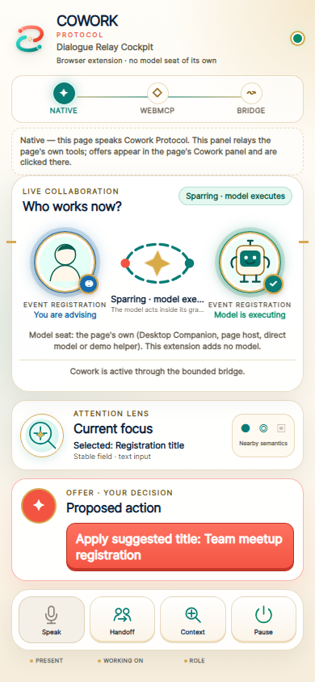
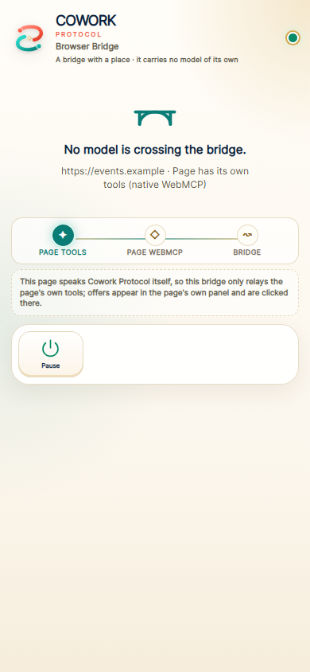
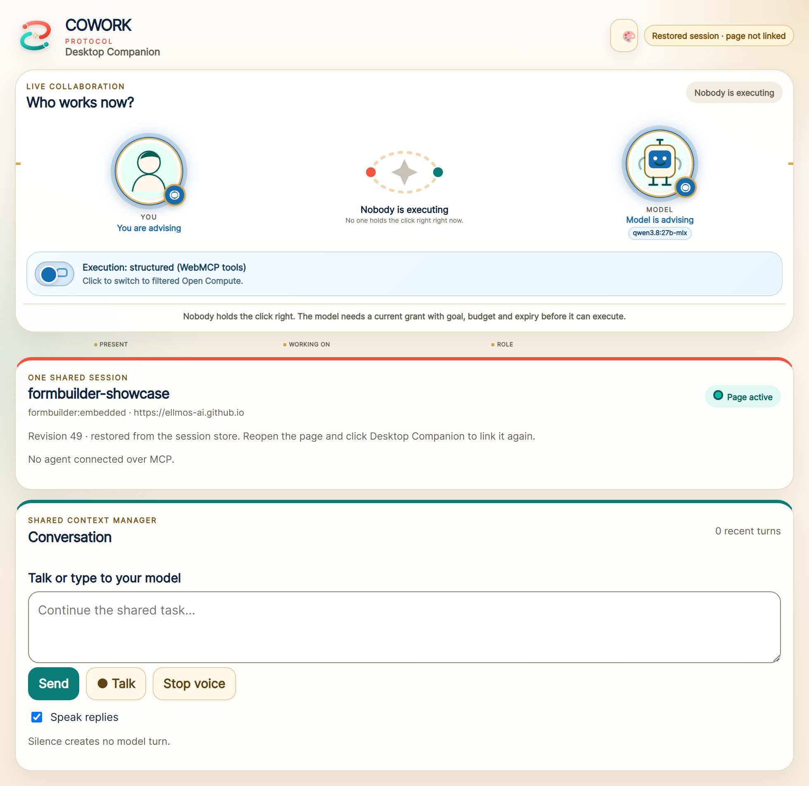

# Panel tour

Every control on the bridge a page builds into itself, named and explained.
The browser extension carries the same deck onto pages that build none, so
what you see here is what you see there. The screenshots come from the live
showcase
(<https://ellmos-ai.github.io/cowork-protocol/apps/formbuilder-showcase/>),
captured in Chrome 152 with `--enable-features=WebMCP,WebMCPTesting` at a
1440×1100 viewport. `node design/panel-tour/capture.mjs` regenerates all of
them, measures the marked regions in the browser and redraws the overlay, so
the boxes cannot drift away from what they point at. The current set was shot
from a locally served copy of this branch
(`COWORK_PANEL_TOUR_URL=http://127.0.0.1:4191/apps/formbuilder-showcase/`),
because the resting bridge below is not deployed yet; re-run it against the
live URL after the next deploy.

## The bridge before anything crosses it

This panel is a bridge, and a bridge has a place. With no model on it, it shows
the mark, the sentence **No model is crossing the bridge.** and the model seat
— the seat is where a model arrives, so it stays. Everything else would answer
a press with a refusal, which is what the panel used to do.

Demo mode is on when the page loads, so a disclosed scripted helper is already
in the seat and the panel below is what you actually meet. Switch demo mode off
and nothing else in, and the panel folds back to the picture above. Switch it
on again and a mark travels the deck once before the instruments reopen.

## The panel with a model on it

Each section is a disclosure. Model seat, Attention lens and Role are open on
arrival because they carry the live state. Conversation does not fold at all: a
shared session that can hide its own talk is no longer shared. Verified
receipts and Handoff arrive closed and open themselves the moment a first
receipt, a grant or an absence exists. A fold you set by hand is remembered on
your next visit; one the panel opens for you is not.

The panel is one instrument. A switcher above the canvas chooses which surface
it serves — *Build your own form* (the Studio) or *Fill the sample form* — and
only the chosen one is on the page, so the panel can never report attention on
a canvas nobody can see. Both are served through the same ten regions below;
nothing here is duplicated per canvas. Nine WebMCP tools carry it to a model that speaks the protocol:
`cowork_read_focus`, `cowork_request_context`, `cowork_read_changes`,
`cowork_read_presence`, `cowork_offer_action`, `cowork_execute_solo`,
`cowork_read_feedback`, `cowork_read_turn` and `cowork_reply_turn`.

## Walkthrough: one session, start to finish

Ten steps on the live page, no install and no account. Open the showcase in
Chrome or Edge 150+ with the WebMCP flags on, or start the browser with
`--enable-features=WebMCP,WebMCPTesting`. Demo mode is on by default: a
disclosed scripted helper, so the whole walkthrough works before you connect
anything of your own.

1. **Arrive.** A switcher offers two canvases, **Build your own form** and
   **Fill the sample form**, with the Cowork panel beside whichever is open.
   *You see* Build your own form already selected and the panel resting at
   *Sparring · you execute* — you hold the click right, the model advises.
2. **Add two fields.** Pick a field type and press **Add field** twice.
   *You see* two rows on the canvas and no Cowork controls anywhere near them:
   the Studio has none of its own. Even before you add anything the panel is
   already on this canvas — the empty Studio is a target in its own right, so
   the lens reads *Working on: Studio canvas*.
3. **Point at the first row.** *You see* the panel's attention lens change to
   `Pointing at: <the field's label> (Studio canvas)` — the panel followed your pointer to
   one field, not to the page.
4. **Say what to do.** Type `make it required` into the conversation box and
   press **Send bounded turn**. *You see* the pointed-at row become required
   at once, with no offer chip and no second click — the words were the click —
   and the newest receipt asking for a verdict. Press **Good**.
5. **Ask for a field.** With the same row pointed at, press **Model suggests a
   field**. *You see* a chip marked *Studio canvas* in the offer list while the
   canvas stays exactly as it was; clicking the chip adds one field and leaves
   one *Verified* receipt.

   

6. **Hand the work over.** Type `Draft good follow-up questions` into **Job to
   hand over** and press **I'm briefly away**. *You see* the model draft six
   fields under one grant with no per-field click. **Hand over, I'll watch**
   does the same thing at a different pace — one draft per click, with you
   present and advising, which is the state below.

   

   The badge now reads *Sparring · model executes*, the figures say *You are
   advising* and *Model is executing*, and the status line names the grant it
   runs under: 1 of 6 drafts used.
7. **Come back.** Press **I'm back**. *You see* the status line report
   *6 fields added*, exactly those six rows highlighted, and the newest receipt
   waiting for a verdict. Press **Good**.
8. **Empty the model seat.** Switch **Demo mode** off under *Showcase add-on*.
   *You see* the model figure go grey and the mode change: an empty seat means
   no model is here, and nothing is proposed. Switch it back on, or connect
   your own OpenAI-compatible endpoint.
9. **Check the browser.** Open **How to enable WebMCP in this browser**.
   *You see* your own browser named, with both routes to switch the experiment
   on — the flags page and the command line.
10. **Prove it from the agent side.** Switch to **Fill the sample form** —
    the panel follows the switch and stays the same instrument — then focus
    *Full name*, then call `document.modelContext.getTools()`. *You see*
    the nine `cowork_*` tools; `cowork_read_focus` returns the bounded packet,
    `cowork_offer_action` leaves the field unchanged until you click the visible
    offer, and `cowork_read_changes` and `cowork_read_feedback` return only the
    latest event. A turn read through `cowork_read_turn` must be answered
    through `cowork_reply_turn` with its exact id, and that reply's offer stays
    inert until clicked too.

### Which mode you were in, at each step

Steps 1 to 5 ran in **Sparring · you execute**. Step 6 changed it, and *which*
mode you land in depends only on where you are: **I'm briefly away** leaves the
model **working alone**, while **Hand over, I'll watch** keeps you present and
advising, which is **Sparring · model executes** — the state in the screenshot
above. Step 7 returns you to Sparring · you execute, and step 8 puts the model
**away**, leaving **You work alone**.

None of these is a setting of its own. Each partner answers *present?*,
*working on what?* and *executing or advising?*; the mode and the click right
follow from the six answers. That is why stepping away changes the pace of the
work but never the model's right to act — the right comes from the grant.

The full matrix, including why two partners are never offered doubling on the
same area, is in [work-modes.md](work-modes.md).

## The ten regions in detail

The ten numbered markers on the image above, in the order they appear down the
panel: what each region is, what a click does, and what the model gets to see.

### 1 · Surface header

The Cowork lockup, the surface the session is currently on (`Embedded · S1`,
where the number is the session revision every surface agrees on), the resolved
work mode, and two buttons that move the panel without moving the session.

- **Detach** opens the panel in a Document Picture-in-Picture window and turns
  into **Dock in page**. A browser without Document PiP is told so
  (`DETACHED_SURFACE_UNAVAILABLE`) instead of failing silently.
- **Chat window** opens the same detached window laid out for conversing: Role
  and Conversation fill it, the transcript takes the height the form sections
  were using and scrolls, and the input grows with it. It is one window and one
  panel, not a copy — the same session, the same model seat, the same handlers,
  and your fold states survive the trip. Pressing it again, or closing the
  window, docks everything back into the page. If the panel is already
  detached, the button switches that window's layout instead of opening a
  second one.
- **Desktop Companion** joins the session at `http://127.0.0.1:47831/cowork/v1`.
  While it is connected the label reads *Connected*, and the panel's own
  conversation controls and both surface buttons are disabled — the companion
  holds the model seat for the whole session.

*The model sees:* nothing extra. Moving the panel changes no protocol state,
which is the point of the revision counter sitting here.

### 2 · Present · Working on · Role

The three questions the whole protocol is built on, one per dot. Hovering each
label shows the question it answers: *Who is here right now*, *Which page, task
or field*, *Executing or advising*. This strip is a readout, not a control —
the answers are set by the two figures below it and by the Role selector.

*The model sees:* `cowork_read_presence` returns the same three values for both
partners. Full matrix in [work-modes.md](work-modes.md).

### 3 · The two figures

You on the left, the model on the right, and between them the mode both answers
add up to. Each figure is a button.

- **Clicking a figure** cycles that partner through the four states: here and
  executing, here and advising, standby, away. The cycle starts from the
  *resolved* status, so a partner whose authority the conflict rule already
  removed moves on from what is actually displayed.
- Both cannot execute on the same area. Try it, and the panel says so: *"Both
  cannot act at once here. The hand on the mouse keeps the click right."*
- An empty model seat reads as **away** — *No model connected* — never as a
  model that advises.

*The model sees:* its own and your availability, area and role, through
`cowork_read_presence`.

### 4 · WebMCP help

A collapsible section that names the browser you are in and tells you how to
switch WebMCP on: the flags page, or the command line with
`--enable-features=WebMCP,WebMCPTesting` — the same feature names the smoke
tests launch Chrome with. The badge reads **Native WebMCP** once
`document.modelContext` is there, **off** when it is not.

*The model sees:* nothing. Without WebMCP the page still works; only
in-browser agent discovery is missing.

### 5 · Model seat and the demo switch

Which model answers, and where it comes from. The slate box is marked
**Showcase add-on — not part of Cowork Protocol or FormBuilder**, because it is
scaffolding for the demo, not protocol.

- **Demo mode** on: a disclosed scripted helper answers and proposes fixed
  values. No language model is involved, and the panel says so.
- Switching it **off** with nothing connected leaves the seat empty, and the
  model figure moves to *away*. Nothing is proposed until you connect one.
- **Connect your own model** takes an OpenAI-compatible endpoint, a model id
  and an optional key kept only in this tab. A local Ollama or LM Studio works
  from a locally served copy; on an HTTPS page the endpoint must be HTTPS too.

*The model sees:* nothing about this section — it decides who the model is.

### 6 · Attention lens

What the model is allowed to look at, and what it got. The large line names the
current target (*Pointing at: Short answer (Studio canvas)*); the line under it
names the area; the metric on the right counts what was actually sent.

- **Look at** chooses the lens: *Follow me* (pointer, clicks and text
  selections), *Text marker only*, *Click focus*, or *Off*. Choosing **Off**
  ends any model work in progress, drops the focus and sends no page context at
  all.
- **Track changes and causes** records which change followed which cause.
  Switching it off clears the recorded events.
- **Preview one related context level** returns exactly one level of related
  context for that one request, and reports how many characters it added. It
  refuses with `STALE_FOCUS` when nothing is focused.

*The model sees:* one bounded focus packet through `cowork_read_focus`, one
extra level only on request through `cowork_request_context`, and the causal
change list through `cowork_read_changes`. Never the screen.

### 7 · Role and offers

The role half of question three, plus everything the model has proposed.

- The **selector** picks the work mode directly. A mode that the state does not
  permit is refused with the reason — *"Both execute at once only on different
  areas"*, or *"A model executes only inside a granted job"*.
- **Offers** are the model's proposals as clickable chips, each naming its
  canvas and its exact proposed value. A chip changes nothing until you click
  it. The offer in the screenshot below waited with *Click to authorize*.
- **What this mode means** folds away what the mode and the model's role
  imply. The section keeps the selector, the click right and the proposals in
  the open; the explanation is one click below them.
- **Create local demo offer** produces one, so the mechanism is visible without
  a model. It lives inside *What this mode means*. Pointing at a Studio field
  renames it to **Model suggests a field** and it proposes into that canvas
  instead.

*The model sees:* `cowork_offer_action` to propose. It cannot click its own
offer; only a trusted human click applies one.

### 8 · Conversation

One bounded turn at a time, typed or spoken. The badge names the transport that
will answer — the local demo helper, your connected model, or the companion.

- **Send bounded turn** sends what is in the box (350 characters maximum). A
  recognized instruction about the field you are pointing at is applied
  directly, with no offer chip in between — the words are the click — and then
  waits for your verdict.
- **Push to talk** dictates into the same box; **Stop voice** cancels
  recognition and playback. Press it again while it is listening to stop.
- **Hold the space bar** to talk for as long as you hold it — press starts,
  release stops, and what you said lands in the box for you to send. It stays
  out of the way while you are typing: in a text field, or on a focused button
  or link, the space bar is still a space. A window that loses focus mid-hold
  closes the microphone instead of leaving it open.
- **Keep listening** keeps the microphone open across the natural pauses that
  otherwise end recognition after about a second. Both this and the held space
  bar collect what you say into the box and leave the sending to you: a turn
  per finished phrase would answer half sentences, which is the same
  silence-makes-no-turn contract seen from the other side.
- While the microphone is open the mark on the button pulses and the button
  reports `aria-pressed="true"`; the transcript line says which of the two
  modes you are in. The pulse stops under `prefers-reduced-motion`.
- **Speak replies** reads answers aloud.
- The transcript stays quiet on its own: *"Silence creates no model turn."*

*The model sees:* the pending turn through `cowork_read_turn` and answers
through `cowork_reply_turn`.

### 9 · Verified receipts

What actually changed, in order, each line beginning with **Verified**. The
counter on the right is the total.

- Every result waits for one of three verdicts: **Good**, **Adjust**,
  **Different**. Only a trusted click resolves it; the receipt keeps asking
  until then.
- Optional direction is capped at 350 characters.

*The model sees:* only the latest feedback event, through
`cowork_read_feedback`.

### 10 · Handoff

Handing work over, and taking it back.

- **Job to hand over** names the goal the grant will carry.
- **Hand over, I'll watch** gives the model the click right while you stay
  present and advise. On the Studio canvas it drafts one field per click.
- **I'm briefly away** / **I'm away longer** mint the same grant and let the
  model spend the budget unattended.
- **I'm back** ends the grant and reports a bounded delta — what changed while
  the model worked — and highlights exactly those rows until you give a
  verdict.
- **Pause model** puts the model on standby; the button then reads *Resume
  model*.
- The microcopy states the live limits, not a fixed sentence: two minutes and
  at most two attempts on the sample form, two minutes and at most six drafts
  on the Studio canvas.

*The model sees:* `cowork_execute_solo`, and only inside a current grant with a
goal, a budget and an expiry.

## The same bridge as a browser extension

For pages that build no bridge of their own, the extension carries this one
there: Chrome's side panel, outside the page DOM, registering the same Cowork
tools over WebMCP. It brings **no model seat of its own** — the seat stays with
the page, the Desktop Companion, a page host or the demo helper — and offers
are applied by a click in the panel that is showing them.

It rests the same way, for the same reason. An agent's first Cowork tool call
is the arrival; ninety seconds of silence is the departure. On a page that
draws its own panel it does not compete at all: it folds to one line and leaves
the clicks where the reader already sees them. Both frames come from
`npm run smoke:companion-cockpit` with `COWORK_COMPANION_EVIDENCE_DIR` set, at
390x844 in Chrome for Testing 152. See
[apps/browser-companion/README.md](../apps/browser-companion/README.md).

## The same session in the Desktop Companion

The Desktop Companion is an app window with no extension involved: not tied to
one browser, with a filtered Computer Use fallback next to structured WebMCP
execution. While it is connected it **holds the session's model seat**, which is
why it is a vehicle and not a bridge: it carries a model across whichever bridge
it is linked to, and the page keeps the click.

Talking works there exactly as it does in the panel: **Talk** for one dictation,
**Keep listening** to hold the microphone open across natural pauses, and the
space bar held down to talk for as long as you hold it. Both of the collecting
modes put what you said in the box and leave the sending to you, the button
pulses and reports `aria-pressed` while the microphone is open, and every way
listening can fail still says which one it was and what to do about it.

The frame comes from a Companion started for the shoot: an in-process host on an
ephemeral port with an empty session store, one locally served showcase page
linked to it, and one fixture reply standing in for the model. It is not a
picture of anyone's running Companion. The capture script has no default for
`COWORK_COMPANION_UI` for that reason — the old default was the port a
developer's own Companion listens on, and one run photographed a live session
and its real conversation into this repository. See
[apps/desktop-companion/README.md](../apps/desktop-companion/README.md).

## Still open

The three surfaces do not yet look like one family at the top: the page panel
carries the surface and revision header shown at marker 1, while the side panel
opens with route chips instead. And the page panel keeps every section
expanded except the WebMCP help, so a first-time visitor meets all ten regions
at once. Both are presentation, not protocol — the contract underneath is the
same in all three.
