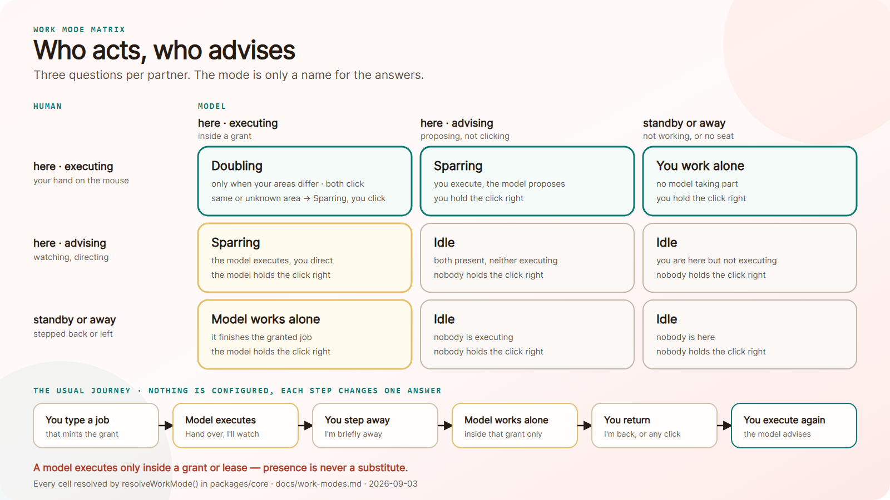

# Work modes: who is here, on what, in which role

Cowork Protocol 0.2 replaces the interaction rhythm *Point → Offer → Click →
Verify* and the separate "Action rights" setting with three questions per
partner. Nothing else is configured, and the work mode is only a name for a
combination of answers.



Every cell above is resolved by `resolveWorkMode()`; the sections below say why
each one reads the way it does.

The old rhythm mixed the two participants into one line. "Point" is something a
human does, "Offer" something a model does, "Click" a human again. It described
one scripted exchange, not the state the session is in. And the same situation
could be entered twice: a paused model was reachable through the presence
control and through the action-rights menu, and the two could disagree.

## The three questions

| Question | Field | Values |
| --- | --- | --- |
| Present? | `availability` | `here` · `standby` · `away` |
| Working on what? | `area` | the page, the task, the focused field, the goal a grant names, or `null` |
| Role? | `role` | `executing` (holds authority) · `advising` (suggests) |

Both partners answer the same three. A human on `standby` stepped away for a
moment; a model on `standby` is connected but not working. A human that is
`away` left; a model that is `away` has no seat connected at all.

`role` only means anything while a partner is `here`. Availability answers *can
you*, role answers *are you*, area answers *on what*.

## The modes are names, not settings

`resolveWorkMode()` in `packages/core` reads the six values and returns the
mode, the authority holder and every action right.

| Both here | Areas | Mode | Authority |
| --- | --- | --- | --- |
| one executes, one advises | any | **Sparring** | the one executing |
| both execute | different | **Doubling** | both, each in its own area |
| both execute | same or unknown | **Sparring** | human |
| neither executes | any | Idle | nobody |

| Partner not here | Mode | Authority |
| --- | --- | --- |
| human executes, model on standby or no seat | **You work alone** | human |
| model executes, human on standby or away | **Model works alone** | model |
| nobody executes | Idle | nobody |

**Sparring** is the back-and-forth: at any moment one partner acts and the other
advises, and the authority swaps as often as you like. *Advisor* is the same
state named by direction: a model that advises is the observation mode with
suggestions; a human that advises is a human directing a working model. One
state, two viewpoints, so the surfaces show it as one mode with the direction
spelled out.

**Doubling** is genuine simultaneity, and it is offered only when the two are on
*different* areas. That is not a preference switch: same area means they would
be in each other's way, so the surfaces do not offer doubling at all there. An
unclaimed area is not a disjoint one; without a named area, nothing proves the
two are apart, and the human keeps authority.

### Authority is the click right

`authority` is not a fourth setting. It is a name for the answer to "who is
executing", and it *is* the permission to click, type and change the page:

```
canExecute(partner) = authority is this partner (or both)
canPropose(partner) = partner is here and does not hold authority
```

That is the whole rights model. There is no separate "Action rights" control any
more, because there is nothing left for it to decide. The old four action modes
map onto the matrix without remainder:

| Old `actionMode` | New state |
| --- | --- |
| `explain` | model `here` + `advising` |
| `suggest` | model `here` + `advising` — the same state, proposing |
| `delegated` | model `here` + `executing`, inside a grant |
| `paused` | model `standby` |

`explain` and `suggest` were never two things. A model that watches and explains
is a model that can also suggest; whether it phrases its next sentence as a
comment or as an offer is a question about that sentence, not about the session.

### A model executes only inside a grant or a lease

This is the security core and it is not softened anywhere.

A model may hold authority only while a valid authority record covers it: a
delegation grant or a solo lease, with a human-authored goal, a call budget and
an expiry. `resolveWorkMode()` takes that as `modelAuthorityValid`. Without it
the model is `advising`, its proposals still need a human click, and the
resolver reports `authorityLapsed` so the surface can say why.

**A present human is never a substitute for the record.** Being in the room does
not authorize the model; it only means a human can intervene. The record is what
bounds *what* the model may do and *for how long*, and that bound is the point.

The human side needs no record. A human who is present and executing is simply
using their own machine.

### The conflict rule: the hand on the mouse wins

If both partners execute and their areas are the same or unknown, the human
keeps authority and the model falls back to advising. This is not a tie-break
invented for the table; it is the return path of the typical session:

> The human writes a prompt. That mints a grant, so the model executes while the
> human watches. The human signs off and leaves; the model finishes the granted
> job alone. The human comes back, by click or by voice, picks up the same area,
> and now the model advises while the human executes.

Nothing is configured at any step, which is the whole design goal: it should
work without thinking about it. Each step changes one answer, and the mode, the
authority and the model's role follow.

## The status bar

Every surface shows the same three-step bar, filled from one shared vocabulary
(`STATUS_STEPS` in `packages/reference-ui`):

**Present · Working on · Role**

This replaced a four-step "Clarify" bar during the rework. The fourth step named
the model's job, which is not a fourth question: the job *is* the role, read off
the same answer. A bar that lists a derived value beside the values it derives
from invites the reader to set it, which is the mistake this rework removes.
Attention and token budget belong under "Working on", because that is what they
scope.

## The model seat is its own axis

Whether a model client is connected at all is a different question from what an
attached model is doing:

| Seat | Availability | Meaning |
| --- | --- | --- |
| disconnected | `away` | no model client, nothing to engage |
| connected | `standby` | attached, deliberately not working |
| connected | `here` | taking part, executing or advising |

Keeping these apart matters because they have different remedies. A model on
standby is woken with a click. A model with no seat needs a seat: the Desktop
Companion, a same-origin model host, an OpenAI-compatible endpoint, or a
WebMCP-capable browser agent. The browser extension has no seat of its own, and
says so rather than pretending.

## Transitions

Both directions work, and they cannot disagree, because both run through the
same function.

| Trigger | Effect |
| --- | --- |
| Click a figure | cycles that partner's status: `here-executing` → `here-advising` → `standby` → `away` → … |
| Click the model's seat toward `executing` | **is the handover**: the surface mints the grant, and the next click on that seat takes the job back |
| Pick a mode | `statusForWorkModeChoice()` sets both partners' status and carries the areas over |
| A prompt, typed or spoken | mints a grant for that job, so the model executes and the human watches |
| Focus a field | sets the human's area, which is also what decides whether doubling is possible |
| "I'm briefly away" / "away longer" | human `standby` / `away`, with a goal that mints the authority record |
| "I'm back", or any click on the page | human returns to executing; the conflict rule takes authority back |
| The record expires | the model returns to advising, and the session says so instead of stopping silently |

Clicking a figure is how you change your partner's status, because the person
clicking is always the human: clicking the model figure parks or wakes the
model, clicking your own figure says whether you are executing or advising.

### The seat click is the authorization; the mode picker is a wish

Both can ask for the same state, and they answer differently on purpose.

Choosing `sparring-model` in the mode picker says what you would like. Without a
grant it snaps back to the mode in force and the surface names what is missing -
a selection is not an authorization, and the security core above does not bend
for a dropdown.

Pressing the model's seat is not a selection. It is a trusted click by the
person who holds the authority, on the actor they are handing the job to, and
that gesture is exactly what a grant records. So the seat mints one: the goal
from the focused target, the same call budget and expiry the surface's
hand-over button uses, and a visible line saying so. Nothing executes outside a
grant either way; the two paths differ in who authored the gesture.

- **Embedded panel** - human here: hand over and watch. Human away: the away
  path, model solo inside the lease. Either way the next press returns the job.
- **Desktop Companion** - the Companion is the Session Authority, so it mints
  the grant itself instead of sending you back to the page. With no page linked
  it says `PAGE_NOT_LINKED`; with no field pointed at, `NO_FOCUSED_TARGET`. A
  grant is about something, and it will not invent what.
- **Browser extension** - mints no grant, so its seat skips `executing` and says
  why. Same rule, applied where no authority record can exist.

## What did not change

The wire is still 0.1. Presence events, action offers, authorizations, receipts,
solo leases, delegation grants and the nine native WebMCP tools keep their
published shapes, and `resolvePresenceMode()` still resolves the four 0.1 modes.
`toLegacyPresence()` and `fromLegacyPresence()` translate in both directions, and
the legacy `effectiveMode` is derived from the legacy values themselves, so a 0.1
consumer that re-resolves the mode always agrees with us.

The 0.1 wire carries a single "who is working" bit, and it sits on the agent
(`agentEngagement`). Plain 0.1 cowork with no engagement field is the
offer-and-click rhythm, so it reads back as the human holding the click right.

The finer distinctions the matrix adds — who holds authority, doubling, the
area, nobody executing — live in the new `workMode` field and in the surfaces,
not on the 0.1 wire.

## Who proposed it

Every offer and every receipt names its author: `seat:<model>` for the Companion's
own model, `mcp:<client>` for a local agent that reached the page through the
Companion, `webmcp-agent` for a tool call made in the page itself, `demo` for
the panel's own demo button. The author is
read from the call as it arrives, so none of the nine tools grew a field. Naming
the author is not granting rights: whoever proposed it, the right to propose is
still the one model seat's `canPropose`, and the right to execute is still a real
human click. Separate rights per actor would be a different change.

## Where this lives

| Concern | File |
| --- | --- |
| The matrix, authority, legacy bridge | `packages/core/src/index.js` |
| Every visible word and badge | `packages/reference-ui/src/index.js` |
| Showcase panel | `apps/formbuilder-showcase/` |
| Browser side panel | `apps/browser-companion/` |
| Desktop Companion | `apps/desktop-companion/` |

No surface writes its own status wording. Three surfaces that spell their own
labels drift apart within a week; one vocabulary module is why the side panel
and the Companion say "Model is advising" in the same words.
